# **ASMSCRIPT-OPTIMIZER-RECIPE-HTMLTEMPLATE v1.4.0**
**AssemblyScript WebAssembly HTMLテンプレート**

このファイルは、ASMSCRIPT-OPTIMIZER-RECIPE v1.4.0で使用する完全なHTMLテンプレートコードです。

## **HTMLテンプレート全文**

```html
<!DOCTYPE html>
<html lang="ja">
<head>
    <meta charset="UTF-8">
    <meta name="viewport" content="width=device-width, initial-scale=1.0">
    <title>AssemblyScript WebAssembly App</title>
    
    <style>
        /* ============================================
           CSS変数定義（テーマシステム）
        ============================================ */
        :root {
            /* ライトテーマ（デフォルト） */
            --bg-primary: #f5f7fa;
            --bg-secondary: white;
            --bg-tertiary: #f9fafb;
            --text-primary: #111827;
            --text-secondary: #6b7280;
            --border-color: #e5e7eb;
            --header-bg: linear-gradient(135deg, #667eea 0%, #764ba2 100%);
            --header-text: white;
            --sidebar-bg: white;
            --code-bg: #1e1e1e;
            --code-text: #e5e7eb;
            --success-color: #4ade80;
            --error-color: #dc3545;
            --warning-color: #ffc107;
            --primary-color: #667eea;
            --secondary-color: #764ba2;
        }
        
        /* ダークテーマ */
        :root[data-theme="dark"] {
            --bg-primary: #1a202c;
            --bg-secondary: #2d3748;
            --bg-tertiary: #4a5568;
            --text-primary: #e2e8f0;
            --text-secondary: #a0aec0;
            --border-color: #4a5568;
            --sidebar-bg: #2d3748;
            --code-bg: #1e1e1e;
            --code-text: #e5e7eb;
        }
        
        /* システムテーマ（ダークモード対応） */
        @media (prefers-color-scheme: dark) {
            :root[data-theme="system"] {
                --bg-primary: #1a202c;
                --bg-secondary: #2d3748;
                --bg-tertiary: #4a5568;
                --text-primary: #e2e8f0;
                --text-secondary: #a0aec0;
                --border-color: #4a5568;
                --sidebar-bg: #2d3748;
                --code-bg: #1e1e1e;
                --code-text: #e5e7eb;
            }
        }
        
        /* ============================================
           グローバルスタイル
        ============================================ */
        * {
            margin: 0;
            padding: 0;
            box-sizing: border-box;
        }
        
        body {
            font-family: -apple-system, BlinkMacSystemFont, 'Segoe UI', Roboto, sans-serif;
            background: var(--bg-primary);
            color: var(--text-primary);
            min-height: 100vh;
            display: flex;
            flex-direction: column;
            transition: background-color 0.3s, color 0.3s;
        }
        
        /* ============================================
           ヘッダー
        ============================================ */
        .header {
            background: var(--header-bg);
            color: var(--header-text);
            padding: 0;
            display: flex;
            align-items: center;
            height: 56px;
            position: sticky;
            top: 0;
            z-index: 1000;
            box-shadow: 0 2px 10px rgba(0,0,0,0.1);
        }
        
        .hamburger {
            width: 56px;
            height: 56px;
            display: flex;
            flex-direction: column;
            justify-content: center;
            align-items: center;
            cursor: pointer;
            transition: background 0.3s;
        }
        
        .hamburger:hover {
            background: rgba(255,255,255,0.1);
        }
        
        .hamburger span {
            width: 24px;
            height: 2px;
            background: white;
            margin: 3px 0;
            transition: 0.3s;
            border-radius: 2px;
        }
        
        .hamburger.active span:nth-child(1) {
            transform: rotate(45deg) translate(5px, 5px);
        }
        
        .hamburger.active span:nth-child(2) {
            opacity: 0;
        }
        
        .hamburger.active span:nth-child(3) {
            transform: rotate(-45deg) translate(7px, -6px);
        }
        
        .header-content {
            flex: 1;
            padding: 0 20px;
            display: flex;
            align-items: center;
            justify-content: space-between;
        }
        
        .header-title {
            display: flex;
            flex-direction: column;
        }
        
        .header-title h1 {
            font-size: 20px;
            font-weight: 600;
        }
        
        .header-title p {
            font-size: 12px;
            opacity: 0.9;
            margin-top: 2px;
        }
        
        .header-controls {
            display: flex;
            align-items: center;
            gap: 16px;
        }
        
        .header-select {
            background: rgba(255,255,255,0.2);
            color: white;
            border: 1px solid rgba(255,255,255,0.3);
            padding: 6px 12px;
            border-radius: 6px;
            font-size: 13px;
            cursor: pointer;
            transition: all 0.2s;
        }
        
        .header-select:hover {
            background: rgba(255,255,255,0.3);
        }
        
        .header-select option {
            background: var(--bg-secondary);
            color: var(--text-primary);
        }
        
        .status-indicator {
            display: flex;
            align-items: center;
            gap: 8px;
            background: rgba(255,255,255,0.2);
            padding: 6px 12px;
            border-radius: 16px;
            font-size: 13px;
        }
        
        .status-dot {
            width: 6px;
            height: 6px;
            border-radius: 50%;
            background: var(--success-color);
            animation: pulse 2s infinite;
        }
        
        .status-dot.loading {
            background: var(--warning-color);
        }
        
        .status-dot.error {
            background: var(--error-color);
        }
        
        @keyframes pulse {
            0%, 100% { opacity: 1; }
            50% { opacity: 0.5; }
        }
        
        /* ============================================
           サイドメニュー
        ============================================ */
        .side-menu {
            position: fixed;
            top: 56px;
            left: -320px;
            width: 320px;
            height: calc(100vh - 56px);
            background: var(--sidebar-bg);
            box-shadow: 2px 0 10px rgba(0,0,0,0.1);
            transition: left 0.3s;
            z-index: 999;
            overflow-y: auto;
        }
        
        .side-menu.active {
            left: 0;
        }
        
        /* タブナビゲーション */
        .tab-navigation {
            display: flex;
            background: var(--bg-tertiary);
            border-bottom: 1px solid var(--border-color);
        }
        
        .tab-button {
            flex: 1;
            padding: 14px;
            background: transparent;
            border: none;
            border-bottom: 2px solid transparent;
            font-size: 13px;
            font-weight: 500;
            color: var(--text-secondary);
            cursor: pointer;
            transition: all 0.2s;
            display: flex;
            align-items: center;
            justify-content: center;
            gap: 6px;
        }
        
        .tab-button:hover {
            background: rgba(0,0,0,0.03);
        }
        
        .tab-button.active {
            color: var(--primary-color);
            border-bottom-color: var(--primary-color);
            background: var(--bg-secondary);
        }
        
        .tab-icon {
            font-size: 16px;
        }
        
        .tab-content {
            display: none;
            height: calc(100vh - 56px - 48px);
            overflow-y: auto;
        }
        
        .tab-content.active {
            display: block;
        }
        
        .menu-section {
            border-bottom: 1px solid var(--border-color);
        }
        
        .menu-header {
            padding: 16px 20px;
            background: var(--bg-tertiary);
            font-weight: 600;
            font-size: 14px;
            color: var(--text-primary);
            display: flex;
            justify-content: space-between;
            align-items: center;
        }
        
        .toggle-switch {
            position: relative;
            width: 44px;
            height: 24px;
            background: #e5e7eb;
            border-radius: 12px;
            cursor: pointer;
            transition: background 0.3s;
        }
        
        .toggle-switch.active {
            background: var(--primary-color);
        }
        
        .toggle-switch::after {
            content: '';
            position: absolute;
            width: 20px;
            height: 20px;
            background: white;
            border-radius: 50%;
            top: 2px;
            left: 2px;
            transition: 0.3s;
            box-shadow: 0 2px 4px rgba(0,0,0,0.2);
        }
        
        .toggle-switch.active::after {
            left: 22px;
        }
        
        .menu-content {
            padding: 16px;
        }
        
        .presets {
            display: grid;
            grid-template-columns: 1fr 1fr;
            gap: 8px;
            margin-bottom: 16px;
        }
        
        .preset-btn {
            padding: 8px;
            border: 1px solid var(--border-color);
            background: var(--bg-secondary);
            border-radius: 6px;
            font-size: 13px;
            color: var(--text-primary);
            cursor: pointer;
            transition: all 0.2s;
        }
        
        .preset-btn:hover {
            background: var(--primary-color);
            color: white;
            border-color: var(--primary-color);
        }
        
        .option-item {
            display: flex;
            align-items: center;
            padding: 10px;
            background: var(--bg-tertiary);
            border-radius: 6px;
            margin-bottom: 8px;
            gap: 10px;
        }
        
        .option-item input[type="checkbox"] {
            width: 16px;
            height: 16px;
        }
        
        .option-item label {
            flex: 1;
            font-size: 13px;
            color: var(--text-primary);
        }
        
        .option-item select {
            padding: 4px 8px;
            border: 1px solid var(--border-color);
            border-radius: 4px;
            font-size: 12px;
            background: var(--bg-secondary);
            color: var(--text-primary);
        }
        
        .code-viewer {
            background: var(--code-bg);
            border-radius: 8px;
            padding: 16px;
            margin-top: 8px;
        }
        
        .code-header {
            color: #9ca3af;
            font-size: 11px;
            margin-bottom: 12px;
            font-family: monospace;
            text-transform: uppercase;
        }
        
        .code-content {
            color: var(--code-text);
            font-family: 'Monaco', 'Menlo', 'Consolas', monospace;
            font-size: 12px;
            line-height: 1.5;
            white-space: pre;
            overflow-x: auto;
            max-height: 300px;
            overflow-y: auto;
        }
        
        /* ============================================
           メインコンテンツ
        ============================================ */
        .main-container {
            flex: 1;
            display: flex;
            flex-direction: column;
            transition: margin-left 0.3s;
        }
        
        .main-container.menu-open {
            margin-left: 320px;
        }
        
        .main-content {
            flex: 1;
            padding: 24px;
            max-width: 1200px;
            width: 100%;
            margin: 0 auto;
            display: flex;
            flex-direction: column;
            gap: 20px;
        }
        
        /* ワークスペース */
        .workspace {
            display: flex;
            gap: 20px;
            flex: 1;
        }
        
        .workspace.single-column {
            justify-content: center;
        }
        
        .workspace-panel {
            background: var(--bg-secondary);
            border-radius: 12px;
            box-shadow: 0 1px 3px rgba(0,0,0,0.1);
            padding: 20px;
            display: flex;
            flex-direction: column;
        }
        
        .workspace-panel.code-panel {
            flex: 1;
            max-width: 50%;
        }
        
        .workspace-panel.app-panel {
            flex: 1;
        }
        
        .workspace.single-column .app-panel {
            max-width: 1000px;
            width: 100%;
        }
        
        .panel-header {
            font-size: 14px;
            font-weight: 600;
            color: var(--text-primary);
            margin-bottom: 16px;
            padding-bottom: 12px;
            border-bottom: 1px solid var(--border-color);
        }
        
        .source-code-display {
            background: var(--code-bg);
            color: var(--code-text);
            padding: 16px;
            border-radius: 8px;
            font-family: 'Monaco', 'Menlo', 'Consolas', monospace;
            font-size: 13px;
            line-height: 1.6;
            overflow: auto;
            flex: 1;
            white-space: pre;
        }
        
        .app-viewport {
            background: white;
            border-radius: 8px;
            border: 1px solid var(--border-color);
            padding: 40px;
            flex: 1;
            display: flex;
            align-items: center;
            justify-content: center;
            min-height: 400px;
        }
        
        :root[data-theme="dark"] .app-viewport,
        :root[data-theme="system"] .app-viewport {
            background: var(--bg-tertiary);
        }
        
        .btn {
            padding: 12px 24px;
            border: none;
            border-radius: 8px;
            font-size: 14px;
            font-weight: 500;
            cursor: pointer;
            transition: all 0.2s;
        }
        
        .btn-primary {
            background: var(--primary-color);
            color: white;
        }
        
        .btn-primary:hover {
            background: #5a67d8;
            transform: translateY(-2px);
            box-shadow: 0 4px 12px rgba(102, 126, 234, 0.3);
        }
        
        .btn-primary:disabled {
            opacity: 0.5;
            cursor: not-allowed;
            transform: none;
        }
        
        .btn-secondary {
            background: var(--bg-tertiary);
            color: var(--text-primary);
            border: 1px solid var(--border-color);
        }
        
        .btn-secondary:hover {
            background: var(--bg-primary);
        }
        
        /* ステータスバー（画面下部） */
        .status-bar {
            position: fixed;
            bottom: -48px;
            left: 0;
            right: 0;
            height: 48px;
            background: var(--bg-secondary);
            border-top: 1px solid var(--border-color);
            display: flex;
            align-items: center;
            padding: 0 24px;
            transition: bottom 0.3s, left 0.3s;
            z-index: 998;
            box-shadow: 0 -2px 10px rgba(0,0,0,0.05);
        }
        
        .status-bar.active {
            bottom: 0;
        }
        
        .status-bar.menu-open {
            left: 320px;
        }
        
        .stats-grid {
            display: flex;
            gap: 32px;
            align-items: center;
            width: 100%;
            justify-content: center;
        }
        
        .stat-item {
            display: flex;
            align-items: center;
            gap: 8px;
        }
        
        .stat-label {
            font-size: 12px;
            color: var(--text-secondary);
        }
        
        .stat-value {
            font-size: 14px;
            font-weight: 600;
            color: var(--text-primary);
        }
        
        /* オーバーレイ */
        .overlay {
            position: fixed;
            top: 56px;
            left: 0;
            right: 0;
            bottom: 0;
            background: rgba(0, 0, 0, 0.3);
            opacity: 0;
            visibility: hidden;
            transition: all 0.3s;
            z-index: 998;
        }
        
        .overlay.active {
            opacity: 1;
            visibility: visible;
        }
        
        /* エラーオーバーレイ */
        .error-overlay {
            position: fixed;
            inset: 0;
            background: rgba(0, 0, 0, 0.5);
            display: none;
            align-items: center;
            justify-content: center;
            z-index: 9999;
            padding: 20px;
        }
        
        .error-card {
            background: var(--bg-secondary);
            border-radius: 12px;
            padding: 24px;
            max-width: 600px;
            width: 100%;
            max-height: 80vh;
            overflow-y: auto;
        }
        
        .error-title {
            color: var(--error-color);
            font-size: 18px;
            font-weight: bold;
            margin-bottom: 12px;
            display: flex;
            align-items: center;
            gap: 8px;
        }
        
        .error-content {
            background: var(--bg-tertiary);
            border-radius: 8px;
            padding: 16px;
            font-family: monospace;
            font-size: 13px;
            line-height: 1.5;
            margin-bottom: 16px;
            white-space: pre-wrap;
            word-break: break-word;
            color: var(--text-primary);
        }
        
        .error-actions {
            display: flex;
            gap: 12px;
            justify-content: flex-end;
        }
        
        .error-btn {
            padding: 8px 16px;
            border: 1px solid var(--border-color);
            background: var(--bg-secondary);
            color: var(--text-primary);
            border-radius: 6px;
            font-size: 14px;
            cursor: pointer;
            transition: all 0.2s;
        }
        
        .error-btn:hover {
            background: var(--bg-tertiary);
        }
        
        .error-btn-primary {
            background: var(--primary-color);
            color: white;
            border-color: var(--primary-color);
        }
        
        .error-btn-primary:hover {
            background: #5a67d8;
        }
        
        /* プログレスバー */
        .progress-container {
            height: 4px;
            background: #e9ecef;
            position: relative;
            overflow: hidden;
        }
        
        .progress-bar {
            height: 100%;
            background: linear-gradient(90deg, var(--primary-color), var(--secondary-color));
            width: 0%;
            transition: width 0.3s ease;
        }
        
        .progress-container.loading .progress-bar {
            animation: progress-indeterminate 1.5s infinite;
        }
        
        @keyframes progress-indeterminate {
            0% {
                width: 0%;
                margin-left: 0%;
            }
            50% {
                width: 30%;
                margin-left: 70%;
            }
            100% {
                width: 0%;
                margin-left: 100%;
            }
        }
        
        /* コンパイラ情報パネル */
        .compiler-info {
            position: fixed;
            bottom: 10px;
            right: 10px;
            background: rgba(0, 0, 0, 0.7);
            color: white;
            padding: 8px 12px;
            border-radius: 6px;
            font-size: 11px;
            font-family: monospace;
            display: none;
            z-index: 500;
        }
        
        .compiler-info.show {
            display: block;
        }
        
        /* CDN状態インジケーター */
        .cdn-status {
            display: inline-block;
            padding: 2px 6px;
            border-radius: 3px;
            font-size: 10px;
            margin-left: 4px;
        }
        
        .cdn-status.jsdelivr {
            background: #ff5627;
            color: white;
        }
        
        .cdn-status.unpkg {
            background: #000000;
            color: white;
        }
        
        /* バージョンソース表示 */
        .version-source {
            display: inline-block;
            padding: 2px 6px;
            border-radius: 3px;
            font-size: 10px;
            background: var(--success-color);
            color: white;
        }
        
        .version-source.fallback {
            background: var(--warning-color);
        }
        
        /* イースターエッグ */
        .easter-egg {
            position: fixed;
            top: 50%;
            left: 50%;
            transform: translate(-50%, -50%);
            background: rgba(0, 0, 0, 0.9);
            color: #00ff00;
            padding: 30px;
            border-radius: 10px;
            font-family: 'Courier New', monospace;
            font-size: 24px;
            font-weight: bold;
            z-index: 10000;
            display: none;
            text-align: center;
            animation: glow 2s ease-in-out infinite;
            border: 2px solid #00ff00;
        }
        
        @keyframes glow {
            0%, 100% { box-shadow: 0 0 20px #00ff00; }
            50% { box-shadow: 0 0 40px #00ff00, 0 0 60px #00ff00; }
        }
        
        .easter-egg.show {
            display: block;
        }
        
        .towel-icon {
            font-size: 48px;
            margin-bottom: 10px;
        }
        
        /* レスポンシブ */
        @media (max-width: 768px) {
            .main-container.menu-open {
                margin-left: 0;
            }
            
            .side-menu {
                width: 280px;
                left: -280px;
            }
            
            .status-bar.menu-open {
                left: 0;
            }
            
            .stats-grid {
                gap: 16px;
                flex-wrap: wrap;
            }
            
            .workspace {
                flex-direction: column;
            }
            
            .workspace-panel.code-panel {
                max-width: 100%;
            }
            
            .header-controls {
                gap: 8px;
            }
            
            .header-select {
                padding: 4px 8px;
                font-size: 12px;
            }
        }
        
        @media (max-width: 480px) {
            .header-title p {
                display: none;
            }
            
            .btn {
                padding: 10px 20px;
                font-size: 13px;
            }
            
            .stats-grid {
                flex-direction: column;
                gap: 8px;
            }
            
            .main-content {
                padding: 16px;
            }
            
            .app-viewport {
                padding: 24px;
            }
        }
        
        /* ユーティリティクラス */
        .hidden {
            display: none !important;
        }
        
        .mb-3 {
            margin-bottom: 12px;
        }
        
        .text-center {
            text-align: center;
        }
    </style>
</head>
<body>
    <!-- ヘッダー -->
    <div class="header">
        <div class="hamburger" onclick="toggleMenu()" id="hamburger">
            <span></span>
            <span></span>
            <span></span>
        </div>
        <div class="header-content">
            <div class="header-title">
                <h1 id="app-title">🚀 AssemblyScript App</h1>
                <p id="app-description">WebAssembly Application</p>
            </div>
            <div class="header-controls">
                <select class="header-select" id="theme-select" onchange="changeTheme()">
                    <option value="system">🌓 システム</option>
                    <option value="light">☀️ ライト</option>
                    <option value="dark">🌙 ダーク</option>
                </select>
                <select class="header-select" id="language-select" onchange="changeLanguage()">
                    <option value="ja">🇯🇵 日本語</option>
                    <option value="en">🇬🇧 English</option>
                </select>
                <div class="status-indicator">
                    <div class="status-dot" id="status-dot"></div>
                    <span id="status-text">初期化中...</span>
                </div>
            </div>
        </div>
    </div>
    
    <!-- プログレスバー -->
    <div class="progress-container loading" id="progress-container">
        <div class="progress-bar" id="progress-bar"></div>
    </div>
    
    <!-- サイドメニュー -->
    <div class="side-menu" id="sideMenu">
        <!-- タブナビゲーション -->
        <div class="tab-navigation">
            <button class="tab-button active" onclick="switchTab('app')">
                <span class="tab-icon">📱</span>
                <span data-i18n="tab.app">アプリ設定</span>
            </button>
            <button class="tab-button" onclick="switchTab('wasm')">
                <span class="tab-icon">⚙️</span>
                <span data-i18n="tab.wasm">WebAssembly</span>
            </button>
        </div>
        
        <!-- アプリ設定タブ -->
        <div class="tab-content active" id="appTab">
            <div class="menu-section">
                <div class="menu-header" data-i18n="section.appModule">AppModule設定</div>
                <div class="menu-content">
                    <p style="color: var(--text-secondary); font-size: 13px; padding: 10px;" data-i18n="appModule.reserved">
                        このセクションは、AppModuleが定義するカスタム設定項目用のリザーブエリアです。
                    </p>
                </div>
            </div>
            
            <!-- デバッグ時のみ表示されるコンパイラ情報 -->
            <div class="menu-section hidden" id="compiler-info-section">
                <div class="menu-header" data-i18n="section.compilerInfo">コンパイラ情報</div>
                <div class="menu-content">
                    <div style="font-size: 12px; color: var(--text-secondary);">
                        <div class="mb-3">
                            <strong data-i18n="info.version">バージョン:</strong> 
                            <span id="compiler-version-info">-</span>
                        </div>
                        <div class="mb-3">
                            <strong data-i18n="info.source">取得元:</strong> 
                            <span id="version-source-info" class="version-source">-</span>
                        </div>
                        <div class="mb-3">
                            <strong>CDN:</strong> 
                            <span id="cdn-provider-info" class="cdn-status">-</span>
                        </div>
                        <div class="mb-3">
                            <strong data-i18n="info.loadTime">読み込み時間:</strong> 
                            <span id="load-time-info">-</span>ms
                        </div>
                        <div>
                            <strong data-i18n="info.attempts">試行回数:</strong> 
                            <span id="load-attempts-info">-</span>
                        </div>
                    </div>
                </div>
            </div>
        </div>
        
        <!-- WebAssembly設定タブ -->
        <div class="tab-content" id="wasmTab">
            <!-- 実行制御セクション（新規追加） -->
            <div class="menu-section">
                <div class="menu-header" data-i18n="section.execution">実行制御</div>
                <div class="menu-content">
                    <div class="option-item">
                        <input type="checkbox" id="auto-compile" checked>
                        <label for="auto-compile" data-i18n="option.autoAssemble">自動アセンブル</label>
                    </div>
                    <div class="option-item">
                        <input type="checkbox" id="show-stats" checked>
                        <label for="show-stats" data-i18n="option.showStats">統計情報を表示</label>
                        <div class="toggle-switch" onclick="toggleStats()" id="statsToggle"></div>
                    </div>
                    <div class="option-item">
                        <input type="checkbox" id="show-code-editor">
                        <label for="show-code-editor" data-i18n="option.showCodeEditor">コードエディターを表示</label>
                    </div>
                    <button class="btn btn-primary" style="width: 100%; margin-top: 12px;" onclick="recompile()" id="recompileBtn">
                        ⟳ <span data-i18n="button.reassemble">再アセンブル</span>
                    </button>
                </div>
            </div>
            
            <div class="menu-section">
                <div class="menu-header" data-i18n="section.presets">コンパイルプリセット</div>
                <div class="menu-content">
                    <div class="presets">
                        <button class="preset-btn" onclick="applyPreset('simple')" data-i18n="preset.simple">シンプル</button>
                        <button class="preset-btn" onclick="applyPreset('debug')" data-i18n="preset.debug">デバッグ</button>
                        <button class="preset-btn" onclick="applyPreset('release')" data-i18n="preset.release">リリース</button>
                        <button class="preset-btn" onclick="applyPreset('minimal')" data-i18n="preset.minimal">最小サイズ</button>
                    </div>
                </div>
            </div>
            
            <div class="menu-section">
                <div class="menu-header" data-i18n="section.optimization">最適化オプション</div>
                <div class="menu-content">
                    <div class="option-item">
                        <input type="checkbox" id="opt-optimize">
                        <label for="opt-optimize">--optimize</label>
                    </div>
                    <div class="option-item">
                        <label>--optimizeLevel</label>
                        <select id="opt-optimizeLevel">
                            <option value="">Default</option>
                            <option value="0">0</option>
                            <option value="1">1</option>
                            <option value="2">2</option>
                            <option value="3">3</option>
                        </select>
                    </div>
                    <div class="option-item">
                        <label>--shrinkLevel</label>
                        <select id="opt-shrinkLevel">
                            <option value="">Default</option>
                            <option value="0">0</option>
                            <option value="1">1</option>
                            <option value="2">2</option>
                        </select>
                    </div>
                </div>
            </div>
            
            <div class="menu-section">
                <div class="menu-header" data-i18n="section.runtime">ランタイムオプション</div>
                <div class="menu-content">
                    <div class="option-item">
                        <label>--runtime</label>
                        <select id="opt-runtime">
                            <option value="stub">stub</option>
                            <option value="minimal" selected>minimal</option>
                            <option value="incremental">incremental</option>
                        </select>
                    </div>
                    <div class="option-item">
                        <input type="checkbox" id="opt-exportRuntime">
                        <label for="opt-exportRuntime">--exportRuntime</label>
                    </div>
                    <div class="option-item">
                        <input type="checkbox" id="opt-importMemory">
                        <label for="opt-importMemory">--importMemory</label>
                    </div>
                    <div class="option-item">
                        <input type="checkbox" id="opt-sharedMemory">
                        <label for="opt-sharedMemory">--sharedMemory</label>
                    </div>
                </div>
            </div>
            
            <div class="menu-section">
                <div class="menu-header" data-i18n="section.debug">デバッグオプション</div>
                <div class="menu-content">
                    <div class="option-item">
                        <input type="checkbox" id="opt-debug">
                        <label for="opt-debug">--debug</label>
                    </div>
                    <div class="option-item">
                        <input type="checkbox" id="opt-sourceMap">
                        <label for="opt-sourceMap">--sourceMap</label>
                    </div>
                    <div class="option-item">
                        <input type="checkbox" id="opt-noAssert">
                        <label for="opt-noAssert">--noAssert</label>
                    </div>
                    <div class="option-item">
                        <input type="checkbox" id="opt-validate">
                        <label for="opt-validate">--validate</label>
                    </div>
                    <div class="option-item">
                        <input type="checkbox" id="opt-measure">
                        <label for="opt-measure">--measure</label>
                    </div>
                </div>
            </div>
            
            <div class="menu-section">
                <div class="menu-header" data-i18n="section.advanced">高度なオプション</div>
                <div class="menu-content">
                    <div class="option-item">
                        <input type="checkbox" id="opt-exportTable">
                        <label for="opt-exportTable">--exportTable</label>
                    </div>
                    <div class="option-item">
                        <input type="checkbox" id="opt-explicitStart">
                        <label for="opt-explicitStart">--explicitStart</label>
                    </div>
                    <div class="option-item">
                        <input type="checkbox" id="opt-lowMemoryLimit">
                        <label for="opt-lowMemoryLimit">--lowMemoryLimit</label>
                    </div>
                </div>
            </div>
        </div>
    </div>
    
    <!-- オーバーレイ -->
    <div class="overlay" id="overlay" onclick="closeMenu()"></div>
    
    <!-- メインコンテンツ -->
    <div class="main-container" id="mainContainer">
        <div class="main-content">
            <div class="workspace" id="workspace">
                <!-- コードパネル（条件付き表示） -->
                <div class="workspace-panel code-panel hidden" id="codePanel">
                    <div class="panel-header">
                        <span data-i18n="panel.sourceCode">📝 AssemblyScript ソースコード</span>
                    </div>
                    <div class="source-code-display" id="source-code-display"></div>
                </div>
                
                <!-- アプリケーションビューポート -->
                <div class="workspace-panel app-panel" id="appPanel">
                    <div class="panel-header">
                        <span data-i18n="panel.application">🚀 アプリケーション</span>
                    </div>
                    <div class="app-viewport" id="app-viewport">
                        <div class="text-center" style="color: var(--text-secondary);">
                            <div style="font-size: 48px; margin-bottom: 16px;">⚙️</div>
                            <div data-i18n="status.initializing">アプリケーションを初期化しています...</div>
                        </div>
                    </div>
                </div>
            </div>
        </div>
    </div>
    
    <!-- ステータスバー -->
    <div class="status-bar" id="statusBar">
        <div class="stats-grid">
            <div class="stat-item">
                <span class="stat-label" data-i18n="stat.wasmSize">WASM:</span>
                <span class="stat-value" id="stat-wasm-size">-</span>
            </div>
            <div class="stat-item">
                <span class="stat-label" data-i18n="stat.compileTime">コンパイル:</span>
                <span class="stat-value" id="stat-compile-time">-</span>
            </div>
            <div class="stat-item">
                <span class="stat-label" data-i18n="stat.optimization">最適化:</span>
                <span class="stat-value" id="stat-opt-level">-</span>
            </div>
            <div class="stat-item">
                <span class="stat-label" data-i18n="stat.memory">メモリ:</span>
                <span class="stat-value" id="stat-memory">-</span>
            </div>
        </div>
    </div>
    
    <!-- エラーオーバーレイ -->
    <div class="error-overlay" id="error-overlay">
        <div class="error-card">
            <div class="error-title">
                ⚠️ <span data-i18n="error.title">エラーが発生しました</span>
            </div>
            <div class="error-content" id="error-content"></div>
            <div class="error-actions">
                <button class="error-btn" onclick="copyError()" data-i18n="button.copyError">エラーをコピー</button>
                <button class="error-btn error-btn-primary" onclick="closeError()" data-i18n="button.close">閉じる</button>
            </div>
        </div>
    </div>
    
    <!-- イースターエッグ -->
    <div class="easter-egg" id="easter-egg">
        <div class="towel-icon">🏖️</div>
        <div>DON'T PANIC</div>
        <div style="font-size: 14px; margin-top: 10px; color: #ffff00;">
            The Answer to the Ultimate Question of<br>
            Life, the Universe, and Everything is...<br>
            <span style="font-size: 48px;">42</span>
        </div>
    </div>
    
    <!-- コンパイラ情報パネル（デバッグ用） -->
    <div class="compiler-info" id="compiler-info">
        AssemblyScript: <span id="compiler-version">-</span> <span id="version-source" class="version-source">-</span><br>
        CDN Provider: <span id="cdn-provider" class="cdn-status">-</span><br>
        Load Time: <span id="load-time">-</span>ms<br>
        Attempts: <span id="load-attempts">-</span>
    </div>
    
    <!-- メインスクリプト -->
    <script type="module">
        // ============================================
        // 国際化（i18n）システム
        // ============================================
        const i18n = {
            ja: {
                'tab.app': 'アプリ設定',
                'tab.wasm': 'WebAssembly',
                'section.appModule': 'AppModule設定',
                'section.execution': '実行制御',
                'section.presets': 'コンパイルプリセット',
                'section.optimization': '最適化オプション',
                'section.runtime': 'ランタイムオプション',
                'section.debug': 'デバッグオプション',
                'section.advanced': '高度なオプション',
                'section.compilerInfo': 'コンパイラ情報',
                'option.autoAssemble': '自動アセンブル',
                'option.showStats': '統計情報を表示',
                'option.showCodeEditor': 'コードエディターを表示',
                'button.reassemble': '再アセンブル',
                'button.copyError': 'エラーをコピー',
                'button.close': '閉じる',
                'preset.simple': 'シンプル',
                'preset.debug': 'デバッグ',
                'preset.release': 'リリース',
                'preset.minimal': '最小サイズ',
                'panel.sourceCode': '📝 AssemblyScript ソースコード',
                'panel.application': '🚀 アプリケーション',
                'stat.wasmSize': 'WASM:',
                'stat.compileTime': 'コンパイル:',
                'stat.optimization': '最適化:',
                'stat.memory': 'メモリ:',
                'status.initializing': 'アプリケーションを初期化しています...',
                'status.compiling': 'コンパイル中...',
                'status.ready': '実行中',
                'error.title': 'エラーが発生しました',
                'info.version': 'バージョン',
                'info.source': '取得元',
                'info.loadTime': '読み込み時間',
                'info.attempts': '試行回数',
                'appModule.reserved': 'このセクションは、AppModuleが定義するカスタム設定項目用のリザーブエリアです。'
            },
            en: {
                'tab.app': 'App Settings',
                'tab.wasm': 'WebAssembly',
                'section.appModule': 'AppModule Settings',
                'section.execution': 'Execution Control',
                'section.presets': 'Compile Presets',
                'section.optimization': 'Optimization Options',
                'section.runtime': 'Runtime Options',
                'section.debug': 'Debug Options',
                'section.advanced': 'Advanced Options',
                'section.compilerInfo': 'Compiler Info',
                'option.autoAssemble': 'Auto Assemble',
                'option.showStats': 'Show Statistics',
                'option.showCodeEditor': 'Show Code Editor',
                'button.reassemble': 'Re-assemble',
                'button.copyError': 'Copy Error',
                'button.close': 'Close',
                'preset.simple': 'Simple',
                'preset.debug': 'Debug',
                'preset.release': 'Release',
                'preset.minimal': 'Minimal',
                'panel.sourceCode': '📝 AssemblyScript Source Code',
                'panel.application': '🚀 Application',
                'stat.wasmSize': 'WASM:',
                'stat.compileTime': 'Compile:',
                'stat.optimization': 'Optimize:',
                'stat.memory': 'Memory:',
                'status.initializing': 'Initializing application...',
                'status.compiling': 'Compiling...',
                'status.ready': 'Running',
                'error.title': 'An error occurred',
                'info.version': 'Version',
                'info.source': 'Source',
                'info.loadTime': 'Load Time',
                'info.attempts': 'Attempts',
                'appModule.reserved': 'This section is reserved for custom settings defined by the AppModule.'
            }
        };
        
        let currentLanguage = 'ja';
        
        function updateLanguage(lang) {
            currentLanguage = lang;
            const translations = i18n[lang];
            
            document.querySelectorAll('[data-i18n]').forEach(element => {
                const key = element.getAttribute('data-i18n');
                if (translations[key]) {
                    element.textContent = translations[key];
                }
            });
            
            localStorage.setItem('language', lang);
        }
        
        // ============================================
        // バージョン管理とメタデータ
        // ============================================
        const VersionManager = {
            cache: {
                get() {
                    try {
                        const cached = sessionStorage.getItem('asc_version_cache');
                        if (cached) {
                            const data = JSON.parse(cached);
                            if (Date.now() - data.timestamp < 3600000) {
                                return data.version;
                            }
                        }
                    } catch (e) {}
                    return null;
                },
                set(version) {
                    try {
                        sessionStorage.setItem('asc_version_cache', JSON.stringify({
                            version,
                            timestamp: Date.now()
                        }));
                    } catch (e) {}
                }
            },
            
            async getLatestVersion() {
                const cached = this.cache.get();
                if (cached) {
                    console.log(`[Version] Using cached: ${cached}`);
                    return cached;
                }
                
                const strategies = [
                    { name: 'jsDelivr API', fn: () => this.fetchFromJsDelivr() },
                    { name: 'jsDelivr Package', fn: () => this.fetchJsDelivrPackageJson() },
                    { name: 'Unpkg', fn: () => this.fetchFromUnpkg() }
                ];
                
                for (const strategy of strategies) {
                    try {
                        console.log(`[Version] Trying ${strategy.name}...`);
                        const version = await Promise.race([
                            strategy.fn(),
                            this.timeout(3000)
                        ]);
                        
                        if (version && this.isValidStableVersion(version)) {
                            console.log(`[Version] Success: ${version}`);
                            this.cache.set(version);
                            return version;
                        }
                    } catch (e) {
                        console.warn(`[Version] ${strategy.name} failed`);
                    }
                }
                
                return "0.28.8";
            },
            
            async fetchFromJsDelivr() {
                const response = await fetch('https://data.jsdelivr.com/v1/package/npm/assemblyscript');
                if (!response.ok) throw new Error(`HTTP ${response.status}`);
                
                const data = await response.json();
                const stable = data.versions.filter(v => this.isValidStableVersion(v));
                if (stable.length === 0) throw new Error('No stable versions found');
                
                return stable[0];
            },
            
            async fetchJsDelivrPackageJson() {
                const response = await fetch('https://cdn.jsdelivr.net/npm/assemblyscript@latest/package.json');
                if (!response.ok) throw new Error(`HTTP ${response.status}`);
                
                const data = await response.json();
                return data.version;
            },
            
            async fetchFromUnpkg() {
                const response = await fetch('https://unpkg.com/assemblyscript@latest/package.json');
                if (!response.ok) throw new Error(`HTTP ${response.status}`);
                
                const data = await response.json();
                return data.version;
            },
            
            isValidStableVersion(version) {
                const semverRegex = /^(\d+)\.(\d+)\.(\d+)$/;
                if (!version.match(semverRegex)) return false;
                
                const preRelease = ['alpha', 'beta', 'rc', 'dev', '-'];
                return !preRelease.some(indicator => 
                    version.toLowerCase().includes(indicator)
                );
            },
            
            timeout(ms) {
                return new Promise((_, reject) => 
                    setTimeout(() => reject(new Error('Timeout')), ms)
                );
            }
        };
        
        // ============================================
        // コンパイラメタデータ
        // ============================================
        const COMPILER_METADATA = {
            version: null,
            versionSource: null,
            fetchedFrom: "NPM Registry via CDN",
            generatedAt: new Date().toISOString(),
            cdnProvider: null,
            loadTime: null,
            attempts: 0,
            
            async initialize() {
                const startTime = performance.now();
                try {
                    this.version = await VersionManager.getLatestVersion();
                    this.versionSource = 'Dynamic';
                    console.log(`[Version] Fetched: v${this.version}`);
                } catch (error) {
                    this.version = "0.28.8";
                    this.versionSource = 'Fallback';
                    console.warn('[Version] Using fallback version');
                }
                const fetchTime = Math.round(performance.now() - startTime);
                console.log(`[Version] Time: ${fetchTime}ms`);
            }
        };
        
        // ============================================
        // CDNプロバイダー定義
        // ============================================
        const CDN_PROVIDERS = [
            {
                name: 'jsDelivr',
                baseUrl: 'https://cdn.jsdelivr.net/npm',
                timeout: 10000,
                priority: 1
            },
            {
                name: 'UNPKG',
                baseUrl: 'https://unpkg.com',
                timeout: 10000,
                priority: 2
            }
        ];
        
        // ============================================
        // アプリケーションモジュール（Counter Demo）
        // ============================================
        const AppModule = {
            name: "Counter Demo",
            description: "シンプルなカウンターアプリケーション",
            
            sourceCode: `
// The Ultimate Answer
let counter: i32 = 42;

// Increment the counter
export function increment(): i32 {
    counter++;
    checkForEasterEgg(counter);
    return counter;
}

// Decrement the counter
export function decrement(): i32 {
    counter--;
    checkForEasterEgg(counter);
    return counter;
}

// Get current value
export function getValue(): i32 {
    return counter;
}

// Reset to the ultimate answer
export function reset(): void {
    counter = 42;
}

// Memory size for debugging
export function getMemorySize(): i32 {
    return memory.size();
}

// Easter egg check (internal)
function checkForEasterEgg(value: i32): void {
    // The answer to life, universe, and everything
    // DON'T PANIC
}
            `.trim(),
            
            defaultOptions: {
                optimize: false,
                runtime: 'minimal'
            },
            
            getImports() {
                return {};
            },
            
            async init(wasmExports) {
                const viewport = document.getElementById('app-viewport');
                viewport.innerHTML = `
                    <div style="text-align: center;">
                        <h2 style="margin-bottom: 20px; color: var(--text-primary);">Counter Demo</h2>
                        <div style="font-size: 72px; font-weight: 200; color: var(--primary-color); line-height: 1; margin-bottom: 32px; cursor: pointer;" id="counter-display">42</div>
                        <div style="display: flex; gap: 12px; justify-content: center; flex-wrap: wrap;">
                            <button class="btn btn-primary" onclick="appIncrement()">+1</button>
                            <button class="btn btn-primary" onclick="appDecrement()">-1</button>
                            <button class="btn btn-secondary" onclick="appReset()">Reset to 42</button>
                        </div>
                        <div style="margin-top: 20px; font-size: 12px; color: var(--text-secondary);">
                            Memory: <span id="memory-size">1</span> pages
                        </div>
                    </div>
                `;
                
                // 初期値の表示
                this.updateDisplay(42, wasmExports);
                
                // イースターエッグトリガー
                this.easterEggCounter = 0;
                this.lastValue = 42;
            },
            
            execute(wasmExports, operation) {
                let value = wasmExports.getValue();
                
                if (operation === 'increment') {
                    value = wasmExports.increment();
                } else if (operation === 'decrement') {
                    value = wasmExports.decrement();
                } else if (operation === 'reset') {
                    wasmExports.reset();
                    value = 42;
                }
                
                this.updateDisplay(value, wasmExports);
                this.checkEasterEgg(value);
            },
            
            updateDisplay(value, wasmExports) {
                const display = document.getElementById('counter-display');
                if (display) {
                    display.textContent = value;
                    
                    // 42の時に特別な色
                    if (value === 42) {
                        display.style.color = '#00ff00';
                        display.style.textShadow = '0 0 20px #00ff00';
                    } else {
                        display.style.color = 'var(--primary-color)';
                        display.style.textShadow = 'none';
                    }
                }
                
                const memSize = document.getElementById('memory-size');
                if (memSize && wasmExports.getMemorySize) {
                    memSize.textContent = wasmExports.getMemorySize();
                }
            },
            
            checkEasterEgg(value) {
                // 42に関連するイースターエッグ
                if (value === 42) {
                    this.easterEggCounter++;
                    
                    // 3回目に42になったらイースターエッグ表示
                    if (this.easterEggCounter === 3) {
                        this.showEasterEgg();
                        this.easterEggCounter = 0;
                    }
                }
                
                // 値が大きく変化したらリセット
                if (Math.abs(value - this.lastValue) > 10) {
                    this.easterEggCounter = 0;
                }
                
                this.lastValue = value;
            },
            
            showEasterEgg() {
                const egg = document.getElementById('easter-egg');
                if (egg) {
                    egg.classList.add('show');
                    setTimeout(() => {
                        egg.classList.remove('show');
                    }, 5000);
                }
            }
        };
        
        // ============================================
        // 安全な初期化
        // ============================================
        let wasmExports = null;
        let isCompiling = false;
        let menuOpen = false;
        let statsVisible = false;
        
        // UI制御関数
        function toggleMenu() {
            menuOpen = !menuOpen;
            const hamburger = document.getElementById('hamburger');
            const sideMenu = document.getElementById('sideMenu');
            const overlay = document.getElementById('overlay');
            const mainContainer = document.getElementById('mainContainer');
            const statusBar = document.getElementById('statusBar');
            
            if (menuOpen) {
                hamburger.classList.add('active');
                sideMenu.classList.add('active');
                overlay.classList.add('active');
                mainContainer.classList.add('menu-open');
                statusBar.classList.add('menu-open');
            } else {
                hamburger.classList.remove('active');
                sideMenu.classList.remove('active');
                overlay.classList.remove('active');
                mainContainer.classList.remove('menu-open');
                statusBar.classList.remove('menu-open');
            }
        }
        
        function closeMenu() {
            if (menuOpen) {
                toggleMenu();
            }
        }
        
        function toggleStats() {
            statsVisible = !statsVisible;
            const statsToggle = document.getElementById('statsToggle');
            const statusBar = document.getElementById('statusBar');
            const showStatsCheckbox = document.getElementById('show-stats');
            
            if (statsVisible) {
                statsToggle.classList.add('active');
                statusBar.classList.add('active');
                showStatsCheckbox.checked = true;
            } else {
                statsToggle.classList.remove('active');
                statusBar.classList.remove('active');
                showStatsCheckbox.checked = false;
            }
            
            localStorage.setItem('statsVisible', statsVisible);
        }
        
        function switchTab(tabName) {
            const tabButtons = document.querySelectorAll('.tab-button');
            tabButtons.forEach(btn => {
                btn.classList.remove('active');
            });
            event.target.closest('.tab-button').classList.add('active');
            
            const tabContents = document.querySelectorAll('.tab-content');
            tabContents.forEach(content => {
                content.classList.remove('active');
            });
            
            if (tabName === 'app') {
                document.getElementById('appTab').classList.add('active');
            } else if (tabName === 'wasm') {
                document.getElementById('wasmTab').classList.add('active');
            }
        }
        
        // テーマ変更
        function changeTheme() {
            const theme = document.getElementById('theme-select').value;
            document.documentElement.setAttribute('data-theme', theme);
            localStorage.setItem('theme', theme);
        }
        
        // 言語変更
        function changeLanguage() {
            const lang = document.getElementById('language-select').value;
            updateLanguage(lang);
        }
        
        // コードエディター表示切り替え
        function toggleCodeEditor() {
            const showCode = document.getElementById('show-code-editor').checked;
            const codePanel = document.getElementById('codePanel');
            const workspace = document.getElementById('workspace');
            
            if (showCode) {
                codePanel.classList.remove('hidden');
                workspace.classList.remove('single-column');
                
                // ソースコードを表示
                const sourceDisplay = document.getElementById('source-code-display');
                if (sourceDisplay) {
                    sourceDisplay.textContent = AppModule.sourceCode;
                }
            } else {
                codePanel.classList.add('hidden');
                workspace.classList.add('single-column');
            }
            
            localStorage.setItem('showCodeEditor', showCode);
        }
        
        window.toggleMenu = toggleMenu;
        window.closeMenu = closeMenu;
        window.toggleStats = toggleStats;
        window.switchTab = switchTab;
        window.changeTheme = changeTheme;
        window.changeLanguage = changeLanguage;
        
        function updateStatus(status, message) {
            const dot = document.getElementById('status-dot');
            const text = document.getElementById('status-text');
            
            if (dot) {
                dot.className = 'status-dot';
                if (status === 'loading') dot.classList.add('loading');
                if (status === 'error') dot.classList.add('error');
            }
            if (text) {
                const translations = i18n[currentLanguage];
                const translationKey = `status.${status}`;
                text.textContent = translations[translationKey] || message;
            }
            
            const progressContainer = document.getElementById('progress-container');
            if (progressContainer) {
                if (status === 'loading') {
                    progressContainer.classList.add('loading');
                } else {
                    progressContainer.classList.remove('loading');
                }
            }
        }
        
        function updateProgress(percent, message, detail = null) {
            const progressBar = document.getElementById('progress-bar');
            const statusText = document.getElementById('status-text');
            
            if (progressBar) progressBar.style.width = `${percent}%`;
            if (statusText) {
                let text = message;
                if (detail) text += ` (${detail})`;
                statusText.textContent = text;
            }
            
            console.log(`[Progress] ${percent}% - ${message}${detail ? ` (${detail})` : ''}`);
        }
        
        // ============================================
        // コンパイラローダー
        // ============================================
        async function loadCompilerWithCDNFallback() {
            const version = COMPILER_METADATA.version;
            console.log(`[Loader] Starting load for AssemblyScript ${version}`);
            
            for (let i = 0; i < CDN_PROVIDERS.length; i++) {
                const cdn = CDN_PROVIDERS[i];
                const startTime = performance.now();
                
                try {
                    updateProgress(30 + (i * 35), 'コンパイラ読み込み中', `${cdn.name} (優先度${cdn.priority})`);
                    
                    const webJsUrl = `${cdn.baseUrl}/assemblyscript@${version}/dist/web.js`;
                    console.log(`[Loader] Attempting ${cdn.name}: ${webJsUrl}`);
                    
                    await loadWebJS(webJsUrl, cdn.timeout);
                    await waitForImportMap();
                    
                    const asc = await import("assemblyscript/asc");
                    const compiler = asc.default || asc;
                    
                    await validateCompiler(compiler);
                    
                    const loadTime = Math.round(performance.now() - startTime);
                    COMPILER_METADATA.cdnProvider = cdn.name;
                    COMPILER_METADATA.loadTime = loadTime;
                    COMPILER_METADATA.attempts = i + 1;
                    
                    console.log(`[Loader] Success with ${cdn.name} in ${loadTime}ms`);
                    updateProgress(100, 'コンパイラ準備完了');
                    
                    updateCompilerInfo();
                    
                    return compiler;
                    
                } catch (error) {
                    console.error(`[Loader] ${cdn.name} failed:`, error.message);
                    cleanupFailedScripts();
                    
                    delete window.ASSEMBLYSCRIPT_VERSION;
                    delete window.ASSEMBLYSCRIPT_IMPORTMAP;
                }
            }
            
            throw new Error(`Failed to load AssemblyScript ${version} from all CDN providers`);
        }
        
        function loadWebJS(url, timeout) {
            return new Promise((resolve, reject) => {
                if (window.ASSEMBLYSCRIPT_VERSION) {
                    console.log('[Loader] AssemblyScript already loaded');
                    resolve();
                    return;
                }
                
                const script = document.createElement('script');
                script.src = url;
                script.dataset.assemblyScript = 'loading';
                
                const timeoutId = setTimeout(() => {
                    script.remove();
                    reject(new Error(`Timeout loading: ${url}`));
                }, timeout);
                
                script.onload = () => {
                    clearTimeout(timeoutId);
                    script.dataset.assemblyScript = 'loaded';
                    console.log('[Loader] Script loaded successfully');
                    setTimeout(resolve, 300);
                };
                
                script.onerror = () => {
                    clearTimeout(timeoutId);
                    script.remove();
                    reject(new Error(`Failed to load script: ${url}`));
                };
                
                document.head.appendChild(script);
            });
        }
        
        async function waitForImportMap() {
            const maxAttempts = 20;
            const waitTime = 100;
            
            for (let i = 0; i < maxAttempts; i++) {
                if (window.ASSEMBLYSCRIPT_VERSION) {
                    console.log('[Loader] Import map and globals ready');
                    return;
                }
                await new Promise(resolve => setTimeout(resolve, waitTime));
            }
            
            throw new Error('Import map setup timeout');
        }
        
        async function validateCompiler(compiler) {
            if (!compiler || typeof compiler.main !== 'function') {
                throw new Error('Invalid compiler object structure');
            }
            
            const testCode = 'export function test(): i32 { return 42; }';
            const { error } = await compiler.main(['test.ts', '--validate'], {
                readFile: (name) => name === 'test.ts' ? testCode : null,
                writeFile: () => {},
                listFiles: () => ['test.ts']
            });
            
            if (error) {
                throw new Error('Compiler validation failed');
            }
            
            console.log('[Loader] Compiler validated successfully');
        }
        
        function cleanupFailedScripts() {
            const scripts = document.querySelectorAll('script[data-assembly-script]');
            scripts.forEach(script => {
                if (script.dataset.assemblyScript !== 'loaded') {
                    console.log('[Loader] Removing failed script tag');
                    script.remove();
                }
            });
        }
        
        function updateCompilerInfo() {
            // デバッグパネル
            document.getElementById('compiler-version').textContent = COMPILER_METADATA.version;
            
            const sourceEl = document.getElementById('version-source');
            sourceEl.textContent = COMPILER_METADATA.versionSource;
            sourceEl.className = COMPILER_METADATA.versionSource === 'Fallback' ? 
                'version-source fallback' : 'version-source';
            
            const cdnEl = document.getElementById('cdn-provider');
            cdnEl.textContent = COMPILER_METADATA.cdnProvider;
            cdnEl.className = `cdn-status ${COMPILER_METADATA.cdnProvider.toLowerCase()}`;
            
            document.getElementById('load-time').textContent = COMPILER_METADATA.loadTime;
            document.getElementById('load-attempts').textContent = COMPILER_METADATA.attempts;
            
            // サイドバー内の情報も更新
            document.getElementById('compiler-version-info').textContent = `v${COMPILER_METADATA.version}`;
            document.getElementById('version-source-info').textContent = COMPILER_METADATA.versionSource;
            document.getElementById('cdn-provider-info').textContent = COMPILER_METADATA.cdnProvider;
            document.getElementById('cdn-provider-info').className = `cdn-status ${COMPILER_METADATA.cdnProvider.toLowerCase()}`;
            document.getElementById('load-time-info').textContent = COMPILER_METADATA.loadTime;
            document.getElementById('load-attempts-info').textContent = COMPILER_METADATA.attempts;
        }
        
        async function safeInit() {
            try {
                console.log('[Init] Starting initialization...');
                
                await COMPILER_METADATA.initialize();
                console.log('[Init] Using AssemblyScript version:', COMPILER_METADATA.version);
                
                const asc = await loadCompilerWithCDNFallback();
                
                if (!asc) {
                    throw new Error('Failed to load compiler');
                }
                
                window.asc = asc;
                
                // 保存された設定を復元
                const savedTheme = localStorage.getItem('theme') || 'system';
                document.getElementById('theme-select').value = savedTheme;
                document.documentElement.setAttribute('data-theme', savedTheme);
                
                const savedLanguage = localStorage.getItem('language') || 'ja';
                document.getElementById('language-select').value = savedLanguage;
                updateLanguage(savedLanguage);
                
                const savedShowCode = localStorage.getItem('showCodeEditor') === 'true';
                document.getElementById('show-code-editor').checked = savedShowCode;
                toggleCodeEditor();
                
                // デバッグモードチェック
                if (localStorage.getItem('debug') === 'true') {
                    document.getElementById('compiler-info').classList.add('show');
                    document.getElementById('compiler-info-section').classList.remove('hidden');
                }
                
                await initializeApp(asc);
                
            } catch (error) {
                console.error('[Init] Failed to initialize:', error);
                showFatalError(`コンパイラの読み込みに失敗しました（v${COMPILER_METADATA.version}）。ページを再読み込みしてください。`);
            }
        }
        
        // ============================================
        // プリセット定義
        // ============================================
        const PRESETS = {
            simple: {
                optimize: false,
                runtime: 'minimal'
            },
            debug: {
                optimize: false,
                optimizeLevel: '0',
                debug: true,
                sourceMap: true,
                measure: true
            },
            release: {
                optimize: true,
                optimizeLevel: '3',
                shrinkLevel: '1',
                noAssert: true
            },
            minimal: {
                optimize: true,
                optimizeLevel: '3',
                shrinkLevel: '2',
                runtime: 'stub',
                noAssert: true
            }
        };
        
        // ============================================
        // コンパイラコア
        // ============================================
        const CompilerCore = {
            compiler: null,
            
            init(ascInstance) {
                this.compiler = ascInstance;
                return true;
            },
            
            async compile(sourceCode, options) {
                if (!this.compiler) {
                    throw new Error('Compiler not initialized');
                }
                
                const compileOptions = this.buildOptions(options);
                let wasmBinary = null;
                let compileStats = '';
                
                const { error, stdout, stderr } = await this.compiler.main(compileOptions, {
                    readFile: (filename) => {
                        if (filename === "main.ts") return sourceCode;
                        return null;
                    },
                    writeFile: (filename, contents) => {
                        if (filename === "main.wasm") {
                            wasmBinary = contents;
                        }
                    },
                    listFiles: () => ["main.ts"]
                });
                
                if (error) throw new Error(stderr || error.toString());
                if (!wasmBinary) throw new Error('No WebAssembly binary generated');
                
                if (stdout) compileStats = stdout;
                
                return { wasmBinary, stats: compileStats };
            },
            
            buildOptions(userOptions) {
                const flags = ["main.ts", "-o", "main.wasm"];
                
                Object.entries(userOptions).forEach(([key, value]) => {
                    if (typeof value === 'boolean' && value) {
                        flags.push(`--${key}`);
                    } else if (typeof value !== 'boolean' && value !== '') {
                        flags.push(`--${key}`, value.toString());
                    }
                });
                
                return flags;
            }
        };
        
        // ============================================
        // オプション管理
        // ============================================
        const OptionsManager = {
            current: {},
            
            init() {
                this.current = { runtime: 'minimal' };
                this.loadFromStorage();
                this.updateUI();
            },
            
            apply(preset) {
                if (PRESETS[preset]) {
                    this.current = { ...PRESETS[preset] };
                    this.updateUI();
                    this.saveToStorage();
                }
            },
            
            collectFromUI() {
                const options = {};
                
                ['optimize', 'exportRuntime', 'noAssert', 'debug', 'sourceMap',
                 'measure', 'validate', 'importMemory', 'sharedMemory',
                 'exportTable', 'explicitStart', 'lowMemoryLimit'].forEach(opt => {
                    const el = document.getElementById(`opt-${opt}`);
                    if (el && el.checked) options[opt] = true;
                });
                
                ['optimizeLevel', 'shrinkLevel', 'runtime'].forEach(opt => {
                    const el = document.getElementById(`opt-${opt}`);
                    if (el && el.value) options[opt] = el.value;
                });
                
                this.current = options;
                this.saveToStorage();
                return options;
            },
            
            updateUI() {
                Object.keys(this.current).forEach(key => {
                    const el = document.getElementById(`opt-${key}`);
                    if (el) {
                        if (el.type === 'checkbox') {
                            el.checked = this.current[key] === true;
                        } else {
                            el.value = this.current[key] || '';
                        }
                    }
                });
            },
            
            saveToStorage() {
                try {
                    localStorage.setItem('asmOptions', JSON.stringify(this.current));
                } catch(e) {}
            },
            
            loadFromStorage() {
                try {
                    const saved = localStorage.getItem('asmOptions');
                    if (saved) this.current = JSON.parse(saved);
                } catch(e) {}
            }
        };
        
        // ============================================
        // WebAssembly実行管理
        // ============================================
        const WasmRunner = {
            instance: null,
            
            async instantiate(wasmBinary, imports = {}) {
                const defaultImports = {
                    env: {
                        abort: (msg, file, line, column) => {
                            console.error(`Abort: ${msg} at ${file}:${line}:${column}`);
                        },
                        trace: (msg, n, ...args) => {
                            console.log(`Trace: ${msg}`, ...args);
                        },
                        seed: () => Date.now(),
                        memory: new WebAssembly.Memory({ initial: 1 })
                    },
                    Math: Math,
                    Date: Date
                };
                
                const mergedImports = this.mergeImports(defaultImports, imports);
                
                let buffer;
                if (wasmBinary instanceof ArrayBuffer) {
                    buffer = wasmBinary;
                } else if (wasmBinary instanceof Uint8Array) {
                    buffer = wasmBinary.buffer.slice(wasmBinary.byteOffset, 
                                                     wasmBinary.byteOffset + wasmBinary.byteLength);
                } else {
                    throw new Error('Unexpected binary format');
                }
                
                const wasmModule = await WebAssembly.compile(buffer);
                this.instance = await WebAssembly.instantiate(wasmModule, mergedImports);
                
                return this.instance.exports;
            },
            
            mergeImports(defaults, custom) {
                const merged = { ...defaults };
                Object.keys(custom).forEach(key => {
                    if (typeof custom[key] === 'object' && !Array.isArray(custom[key])) {
                        merged[key] = { ...defaults[key], ...custom[key] };
                    } else {
                        merged[key] = custom[key];
                    }
                });
                return merged;
            }
        };
        
        // ============================================
        // 統計情報更新
        // ============================================
        function updateStats(compileTime, wasmSize) {
            document.getElementById('stat-compile-time').textContent = 
                compileTime ? `${compileTime}ms` : '-';
            document.getElementById('stat-wasm-size').textContent = 
                wasmSize ? `${(wasmSize / 1024).toFixed(1)}KB` : '-';
            
            const optLevel = document.getElementById('opt-optimize').checked ? 
                (document.getElementById('opt-optimizeLevel').value || 'default') : 'OFF';
            document.getElementById('stat-opt-level').textContent = optLevel;
            
            if (wasmExports && wasmExports.memory) {
                const pages = wasmExports.memory.buffer.byteLength / (64 * 1024);
                document.getElementById('stat-memory').textContent = `${pages} page${pages !== 1 ? 's' : ''}`;
            }
        }
        
        // ============================================
        // エラー処理
        // ============================================
        function showError(error) {
            console.error(error);
            document.getElementById('error-content').textContent = 
                error.stack || error.message || String(error);
            document.getElementById('error-overlay').style.display = 'flex';
            updateStatus('error', 'エラーが発生しました');
        }
        
        window.closeError = function() {
            document.getElementById('error-overlay').style.display = 'none';
        };
        
        window.copyError = async function() {
            const content = document.getElementById('error-content').textContent;
            try {
                await navigator.clipboard.writeText(content);
                alert('エラー内容をコピーしました');
            } catch(e) {
                console.error('Copy failed:', e);
            }
        };
        
        window.applyPreset = function(preset) {
            OptionsManager.apply(preset);
            recompile();
        };
        
        // ============================================
        // コンパイル処理
        // ============================================
        async function compile() {
            if (isCompiling) return;
            isCompiling = true;
            
            const startTime = performance.now();
            
            try {
                updateStatus('loading', 'コンパイル中...');
                
                const options = OptionsManager.collectFromUI();
                const { wasmBinary, stats } = await CompilerCore.compile(
                    AppModule.sourceCode, 
                    options
                );
                
                const imports = AppModule.getImports();
                wasmExports = await WasmRunner.instantiate(wasmBinary, imports);
                
                const compileTime = Math.round(performance.now() - startTime);
                const wasmSize = wasmBinary.byteLength || wasmBinary.length;
                
                updateStats(compileTime, wasmSize);
                
                if (AppModule.init) {
                    await AppModule.init(wasmExports);
                }
                
                updateStatus('ready', '実行中');
                
                if (AppModule.execute) {
                    AppModule.execute(wasmExports);
                }
                
                return true;
            } catch (error) {
                showError(error);
                return false;
            } finally {
                isCompiling = false;
            }
        }
        
        async function recompile() {
            const btn = document.getElementById('recompileBtn');
            const originalText = btn.innerHTML;
            const translations = i18n[currentLanguage];
            btn.innerHTML = '⏳ ' + (translations['status.compiling'] || 'コンパイル中...');
            btn.disabled = true;
            
            await compile();
            
            btn.innerHTML = originalText;
            btn.disabled = false;
            
            closeMenu();
        }
        
        window.recompile = recompile;
        
        // ============================================
        // グローバル関数（AppModuleから呼び出し可能）
        // ============================================
        window.appIncrement = function() {
            if (wasmExports && wasmExports.increment && AppModule) {
                AppModule.execute(wasmExports, 'increment');
            }
        };
        
        window.appDecrement = function() {
            if (wasmExports && wasmExports.decrement && AppModule) {
                AppModule.execute(wasmExports, 'decrement');
            }
        };
        
        window.appReset = function() {
            if (wasmExports && wasmExports.reset && AppModule) {
                AppModule.execute(wasmExports, 'reset');
            }
        };
        
        // ============================================
        // Fatal error表示
        // ============================================
        function showFatalError(message) {
            document.getElementById('status-text').textContent = message;
            document.getElementById('status-dot').className = 'status-dot error';
            document.getElementById('app-viewport').innerHTML = `
                <div style="text-align: center; color: var(--error-color);">
                    <div style="font-size: 48px; margin-bottom: 16px;">⚠️</div>
                    <div style="font-size: 18px; font-weight: bold;">初期化エラー</div>
                    <div style="margin-top: 12px; color: var(--text-secondary);">${message}</div>
                    <button onclick="location.reload()" style="margin-top: 20px; padding: 10px 20px; background: var(--primary-color); color: white; border: none; border-radius: 6px; cursor: pointer;">
                        ページを再読み込み
                    </button>
                </div>
            `;
        }
        
        // ============================================
        // メインアプリケーション初期化
        // ============================================
        async function initializeApp(asc) {
            console.log('[Init] Starting application initialization...');
            console.log('[Init] Version:', COMPILER_METADATA.version, `(${COMPILER_METADATA.versionSource})`);
            console.log('[Init] Compiler loaded via:', COMPILER_METADATA.cdnProvider);
            console.log('[Init] Load time:', COMPILER_METADATA.loadTime + 'ms');
            console.log('[Init] Attempts:', COMPILER_METADATA.attempts);
            
            document.getElementById('app-title').textContent = `🚀 ${AppModule.name}`;
            document.getElementById('app-description').textContent = AppModule.description;
            
            // コードエディター表示設定
            document.getElementById('show-code-editor').addEventListener('change', toggleCodeEditor);
            
            // 統計表示設定
            const showStatsCheckbox = document.getElementById('show-stats');
            showStatsCheckbox.addEventListener('change', (e) => {
                statsVisible = e.target.checked;
                toggleStats();
            });
            
            const savedStatsVisible = localStorage.getItem('statsVisible');
            if (savedStatsVisible === 'true') {
                statsVisible = true;
                document.getElementById('statsToggle').classList.add('active');
                document.getElementById('statusBar').classList.add('active');
                showStatsCheckbox.checked = true;
            }
            
            CompilerCore.init(asc);
            OptionsManager.init();
            
            if (AppModule.defaultOptions) {
                OptionsManager.current = { ...AppModule.defaultOptions };
                OptionsManager.updateUI();
            }
            
            updateStatus('loading', 'コンパイル準備中...');
            
            // 自動コンパイル
            const autoCompile = document.getElementById('auto-compile');
            if (autoCompile.checked) {
                await compile();
            } else {
                updateStatus('ready', '待機中');
                document.getElementById('app-viewport').innerHTML = `
                    <div class="text-center" style="color: var(--text-secondary);">
                        <div style="font-size: 48px; margin-bottom: 16px;">⏸️</div>
                        <div>自動アセンブルが無効です</div>
                        <button class="btn btn-primary" style="margin-top: 20px;" onclick="recompile()">
                            ⟳ アセンブル開始
                        </button>
                    </div>
                `;
            }
            
            console.log('[Init] Application initialized successfully');
        }
        
        // ============================================
        // エントリーポイント
        // ============================================
        document.addEventListener('DOMContentLoaded', () => {
            console.log('[Init] DOM ready, preparing initialization...');
            document.getElementById('status-text').textContent = 'コンパイラを読み込み中...';
        });
        
        setTimeout(() => {
            safeInit().catch(error => {
                console.error('[Init] Initialization failed:', error);
                showFatalError('初期化に失敗しました: ' + error.message);
            });
        }, 100);
    </script>
</body>
</html>
```

## **デフォルトデモについて**

このHTMLテンプレートには、シンプルなカウンターアプリがデフォルトデモとして含まれています。

### **カウンターアプリの機能**
- ➕ **増加**: カウンターを1増やす
- ➖ **減少**: カウンターを1減らす  
- 🔄 **リセット**: カウンターを0にリセット
- メモリサイズの表示（WebAssemblyページ数）

### **AppModuleの置き換え**

ユースケースに応じて、`AppModule`オブジェクトを別の実装に置き換えることで、様々なアプリケーションを作成できます。また、アプリ設定タブはAppModule用のカスタム設定項目の配置場所として使用します。

## 実装フロー

```mermaid
graph LR
    A[メインレシピ] -->|概念理解| B[実装方針決定]
    C[HTMLテンプレート] -->|コピー&ペースト| D[実装]
    B --> D
    D --> E[カスタマイズ]
```



---

**ファイルサイズ**: 約65KB（HTML形式）  
**バージョン**: 1.4.0  
**最終更新**: 2025年9月
