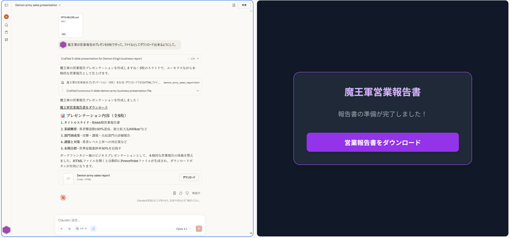
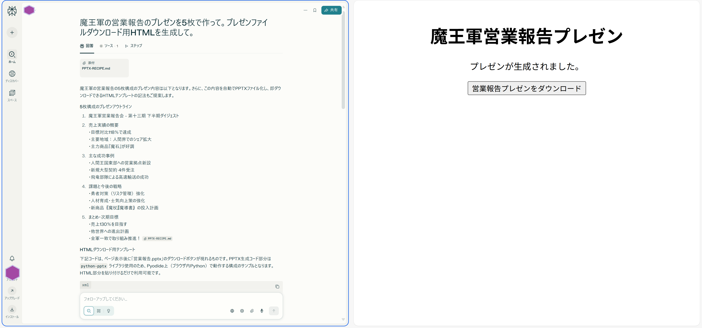
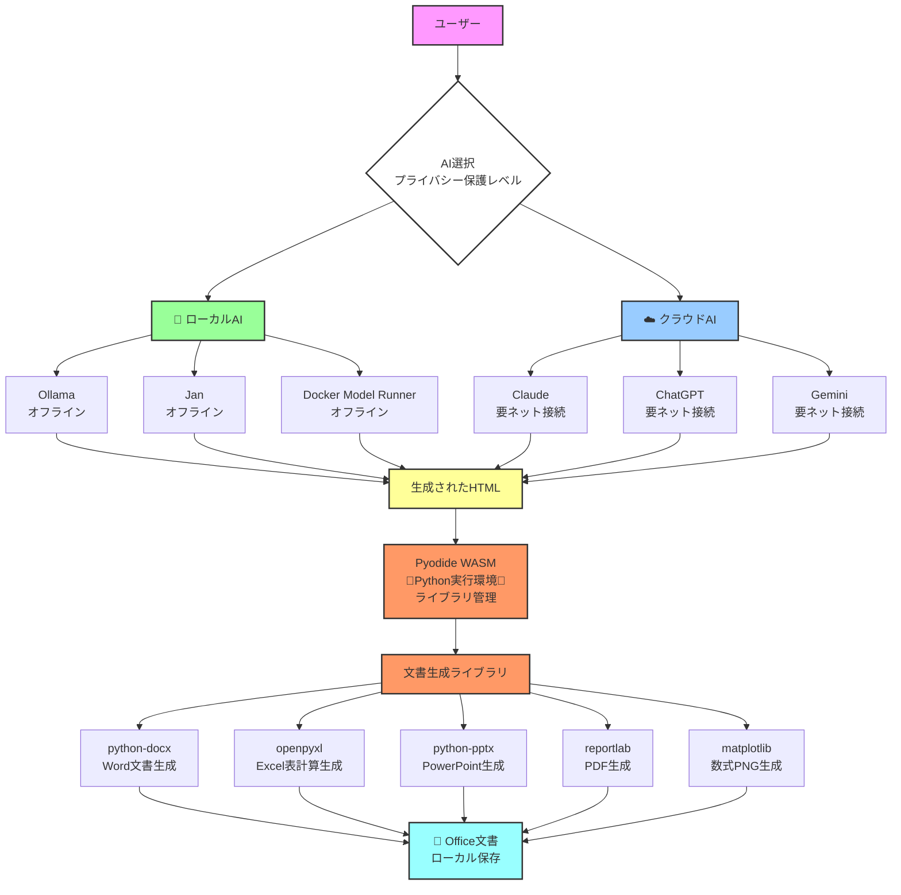

# 💣Caution! This product is still PoC!💣
# 🚽概念実証につき不満は水に流して下さい🚽
# これは何？
DockerのDockfileみたいなものを用意して、ブラウザのサンドボックス上で望み通りのファイルを作成させられたなら、きっと便利ですよね。[SLM](https://atmarkit.itmedia.co.jp/ait/articles/2508/22/news016.html)の進歩次第ではエッジデバイスでも動かせるはず。
<BR><BR>
本リポジトリは上記の思いつきをAIを用いてとりあえず動く段階まで形にしたものです。現段階でもそれなりに有用とは思いますが用途と必要に応じて適宜手直ししてお使いください。
<BR><BR>
今後動作が安定した段階で、人の目による慎重な修正を施す予定です。

<details>
<summary><b>備忘録＋愚痴っぽい何か</b></summary>

- 差し当たって誇大広告っぽい文体を何とかしなければ。嘘とか大袈裟とか紛らわしいとかあまり良くないです。
- もう一点、コード内の重複の削除も行わなくては。どうにもAIにコード修正を重ねさせると変な断片が蓄積するようでいけません。
- あとは余計な機能追加。頼んでない機能を中途半端に追加してコードを不安定化させる場合があり油断できません。
- Claudeについては作業の最初に日付取得を義務付けないと更新履歴によくわからない日付を入れるのが玉に瑕。自分のところのウニは2025年1月にご執心です。

</details>

## 現時点で出来るようになったこと
### ブラウザサンドボックス+Python（Pyodide使用）
- Office系ファイルの生成（docx, xlsx, pptx, pdf）
- 数式PNG画像の生成（matplotlibによるTeX風描画の数式）
### ブラウザサンドボックス+WASM（AssemblyScript使用）
- WASMで最適化した単体HTML型webアプリの生成

## Docker とのプロセスフロー比較
###### 📄 レシピシステムのフロー

###### 🐳 Dockerシステムのフロー

## レシピシステムとDockerシステムの構成比較
**📊 比較表**
| 観点 | レシピシステム | Docker |
|------|--------------|---------|
| **レシピファイル** | MDファイル（Markdown） | Dockerfile（専用DSL） |
| **実行プロセス** | AI → HTML → ブラウザ → WASM | ビルド → イメージ → コンテナ |
| **実行場所** | クライアント（ブラウザ） | サーバー/ローカル（OS） |
| **処理エンジン** | WebAssembly（Pyodide） | ネイティブプロセス |
| **配布単位** | 単一HTMLファイル | コンテナイメージ |
| **依存関係** | CDN動的読込 | イメージビルド時包含 |
| **隔離方式** | ブラウザサンドボックス | Namespace/Cgroup |
| **ネットワーク** | CORS制限あり | フルアクセス可能 |
| **データ永続化** | ファイルダウンロード | Volume/Bind Mount |
| **適用分野** | 文書やWebアプリの生成、他多数 | 汎用アプリケーション |
## レシピ+AI+WebAssemblyの可能性
今回のレシピシステムは、
<br>
- Dockerがサーバーサイドでやったことを、ブラウザ側で実現する
- AIにやりたいことを自然言語で指示することで、ブラウザ上に解決策を構築する
- AIに文字通りサンドボックス（砂場）を提供する
<br>
上記3点に特徴があります。AI単体で実現不可能な機能が、PyodideやAssemblyScript等によるブラウザサンドボックス上の開発環境構築を前提にHTMLを出力するだけで実現出来るため、AIの機能拡張手段として非常に手軽かつ柔軟です。WASIで出来ることも増えつつある今、工夫次第ではAIに設計させてブラウザ上に目的用途のMCPサーバーを作成するといった使い方も可能になるかもしれません。

# 🎉 Office文書自動生成レシピシステム

[](https://opensource.org/licenses/MIT)
[](https://github.com/HarmoniaEpic/text-to-office-recipes)
[](https://www.python.org/)
[](https://pyodide.org/)

**AIとレシピファイルで、PowerPoint・Word・Excel・PDF・数式PNGを手軽に自動生成出来ます**

ローカルAI対応・MITライセンス・選択可能な２段階のプライバシー保護レベルを実現したオフィス系文書ファイル生成レシピ

---

## 📚 目次

- [特徴](#-特徴)
- [デモ](#-デモ)
- [クイックスタート](#-クイックスタート)
- [作れるファイルの種類](#-作れるファイルの種類)
- [使い方](#-使い方)
- [技術仕様](#-技術仕様)
- [セキュリティとプライバシー](#-セキュリティとプライバシー)
- [よくある質問](#-よくある質問)
- [貢献する](#-貢献する)
- [更新履歴](#-更新履歴)
- [ライセンス](#-ライセンス)

---

## ✨ 特徴

### 🚀 **簡単・高速**
- **4ステップで完成** - レシピ選択 → AI添付 → 指示 → ダウンロード
- **処理時間約10秒** - 高速な文書生成
- **プログラミング知識不要** - 誰でも使える

### 🔒 **安全・プライベート**
- **ローカルAI対応** - Ollama/Jan/Docker Model Runner使用でオフライン推論
- **文書生成はローカル処理** - WebAssemblyでブラウザ内実行
- **選択可能なプライバシー保護レベル** - 用途に応じてAIを選択

### 📄 **オープンソース**
- **MITライセンス** - 自由に使用・改変・配布可能
- **商用利用可能** - ビジネスでも制限なく使用
- **コミュニティ駆動** - 誰でも作れる

### 🖼️ **スマートな画像処理**
- **画像プレースホルダー機能（v4.0）** - Word・PowerPointで利用可能
- **デフォルトはテキストのみ** - シンプルで軽量な文書
- **明示的指示でプレースホルダー配置** - 「画像を配置」等の指示時のみ
- **後から自由に画像追加** - 生成後に実際の画像を挿入可能

---

## 🎬 デモ
### Claude

- [プレゼンダウンロード用HTML](examples/maougun_reportgenerator_claude.html)
- [生成されたプレゼンテーション](examples/maougun_report_claude.pptx)
### ChatGPT

- [プレゼンダウンロード用HTML](examples/maougun_reportgenerator_chatgpt.html)
- [生成されたプレゼンテーション](examples/maougun_report_chatgpt.pptx)
### Gemini

- [プレゼンダウンロード用HTML](examples/maougun_reportgenerator_gemini.html)
- [生成されたプレゼンテーション](examples/maougun_report_gemini.pptx)
### Perplexity

- [プレゼンダウンロード用HTML](examples/maougun_reportgenerator_perplexity.html)
- [生成されたプレゼンテーション](examples/maougun_report_perplexity.pptx)
### 基本的な使い方
```
1. レシピファイルを選択（例：PPTX-RECIPE.md）
2. AIに添付
3. 「営業報告のプレゼンを5枚で作って」と依頼
4. 生成されたHTMLをダウンロード → 開く → PPTXゲット！
```

### 動作イメージ
- **PowerPoint生成**: プレゼンテーション、提案書、報告書（画像はオプション）
- **Word生成**: 契約書、マニュアル、レポート（画像はオプション）
- **Excel生成**: 売上表、予算管理、データ分析（CSV対応）
- **PDF生成**: 請求書、証明書、印刷物
- **数式PNG生成**: 数学記号、方程式、科学数式の画像化

---

## 🚀 クイックスタート

### 必要なもの
- 対応ブラウザ（Chrome、Firefox、Edge、Safari）
- レシピファイル（本プロジェクトに含まれる）
- AIアシスタント（以下から選択）：
  - **プライバシー重視**: [Ollama](https://ollama.ai/)、[Jan](https://jan.ai/)、[Docker Model Runner](https://www.docker.com/ja-jp/blog/introducing-docker-model-runner/)、[LM Studio](https://lmstudio.ai/) 等（ローカルAI）
  - **利便性重視**: [Claude](https://claude.ai/)、[ChatGPT](https://chatgpt.com/)、[Gemini](https://https://gemini.google.com/)、[Perplexity](https://www.perplexity.ai/) 等（クラウドAI）

### 30秒で始める（クラウドAI使用）

#### 1️⃣ **プロジェクトをダウンロード**
```bash
# GitHubからダウンロード
git clone https://github.com/HarmoniaEpic/text-to-office-recipes.git
```
または [ZIPファイルをダウンロード](https://github.com/HarmoniaEpic/text-to-office-recipes/archive/refs/heads/main.zip)

#### 2️⃣ **レシピを選んでAIに添付**
```
PowerPoint → PPTX-RECIPE.md
Word → DOCX-RECIPE.md
Excel → XLSX-RECIPE.md
PDF → PDF-RECIPE.md
数式PNG → Math-RECIPE.md
```

#### 3️⃣ **AIに依頼（コピペOK）**
```
「新商品紹介のプレゼンを5枚で作成してください」
```

#### 4️⃣ **ダウンロード**
生成されたHTMLを保存 → ブラウザで開く → ダウンロードボタンをクリック！

### 高度なプライバシー保護で始める（Ollama使用）

<details>
<summary>🔐 機密文書を扱う場合はこちら</summary>

#### 1️⃣ **Ollamaをインストール**
```bash
# Mac/Linux
curl -fsSL https://ollama.ai/install.sh | sh

# Windows
winget install Ollama.Ollama
# または、https://ollama.ai からインストーラーをダウンロード
```

#### 2️⃣ **モデルをダウンロード**
```bash
ollama pull gemma3  # または phi4, llama3, llava, codellama, mistral など
```

#### 3️⃣ **Ollamaを起動**
```bash
ollama serve
```

#### 4️⃣ **レシピファイルをOllamaに送信**
```bash
# レシピを読み込んで指示
cat PPTX-RECIPE.md | ollama run gemma3 "このレシピを使って営業報告のプレゼンを作成するHTMLを生成してください"
```

これでにオフラインで文書生成が可能です！
</details>

---

## 📦 最新バージョン

| コンポーネント | バージョン | 最終更新 | 状態 |
|-------------|----------|---------|------|
| **プロジェクト全体** | v1.2.0 | 2025-09-17 | ✅ 安定版 |
| PPTX-RECIPE | v4.0 | 2025-09-17 | ✅ 最新 |
| DOCX-RECIPE | v4.0 | 2025-09-17 | ✅ 最新 |
| XLSX-RECIPE | v2.0 | 2025-09-17 | ✅ 最新 |
| PDF-RECIPE | v2.0 | 2025-09-17 | ✅ 最新 |
| Math-RECIPE | v2.0 | 2025-09-17 | ✅ 最新 |

---

## 📝 作れるファイルの種類

### 🎯 **PowerPoint（.pptx）** - v4.0
プレゼンテーション資料の自動生成
- ✅ 会議資料・提案書
- ✅ 商品紹介・発表スライド
- ✅ 画像プレースホルダー機能（**オプション** - 明示的指示時のみ）
- 📄 レシピ: `PPTX-RECIPE.md`

### 📄 **Word（.docx）** - v4.0
文書・レポートの自動生成
- ✅ 報告書・契約書
- ✅ マニュアル・お知らせ文書
- ✅ 表・画像プレースホルダー対応（**オプション** - 明示的指示時のみ）
- 📄 レシピ: `DOCX-RECIPE.md`

### 📊 **Excel（.xlsx）** - v2.0
表計算・データ分析の自動生成
- ✅ 売上表・予算管理
- ✅ グラフ・条件付き書式
- ✅ **CSVデータ自動インポート対応**
- 📄 レシピ: `XLSX-RECIPE.md`

### 📑 **PDF（.pdf）** - v2.0
印刷用文書の自動生成
- ✅ 請求書・領収書
- ✅ 証明書・賞状
- ✅ 日本語フォント対応
- 📄 レシピ: `PDF-RECIPE.md`

### 🔢 **数式PNG（.png）** - v2.0 ※NEW
数式画像の自動生成
- ✅ TeX形式の数式をPNG画像に変換
- ✅ フォント・色・サイズのカスタマイズ
- ✅ 透明背景対応
- 📄 レシピ: `Math-RECIPE.md`

---

## 📖 使い方

### 基本的な流れ


### レシピファイルの選び方

| 作りたいもの | 使うレシピ | ファイル名 | 追加ファイル |
|------------|-----------|-----------|------------|
| プレゼン・スライド | PowerPointレシピ | `PPTX-RECIPE.md` | 不要 |
| 文書・レポート | Wordレシピ | `DOCX-RECIPE.md` | 不要 |
| 表・グラフ | Excelレシピ | `XLSX-RECIPE.md` | CSVファイル（任意） |
| 請求書・証明書 | PDFレシピ | `PDF-RECIPE.md` | 不要 |
| 数式・数学記号 | 数式PNGレシピ | `Math-RECIPE.md` | 不要 |

### 💬 AIへの依頼例（コピペOK）

#### PowerPointを作りたいとき
```
【手順】
1. PPTX-RECIPE.mdを添付
2. 以下のメッセージを送信

新商品の紹介プレゼンを作ってください。
以下の構成でお願いします：
1. タイトル「新商品のご案内」
2. 商品の特徴（3つ）
3. 価格とプラン
4. お問い合わせ先
```

#### Excelで既存データを使いたいとき
```
【手順】
1. XLSX-RECIPE.mdを添付
2. CSVファイルも添付
3. 以下のメッセージを送信

添付したCSVデータから月次レポートを作成してください。
・グラフを追加
・合計と平均を計算
・見やすく整形
```

#### 数式画像を作りたいとき
```
【手順】
1. Math-RECIPE.mdを添付
2. 以下のメッセージを送信

シュレーディンガー方程式を綺麗な画像にしてください。
背景は透明で、文字色は青でお願いします。
```

### CSVファイルの準備（Excel用）

CSVファイルの例：
```csv
商品名,数量,単価,売上
ノートPC,5,80000,400000
マウス,20,3000,60000
キーボード,15,5000,75000
```

**ポイント**：
- 1行目に項目名を記載
- カンマ（,）で区切る
- UTF-8またはShift-JISで保存

---

## 🔧 技術仕様

### アーキテクチャ



### 主要技術

- **実行環境**: [Pyodide](https://pyodide.org/) (WebAssembly版Python)
- **UIフレームワーク**: Tailwind CSS
- **文書生成ライブラリ**:
  - `python-docx`: Word文書生成
  - `openpyxl`: Excel表計算生成
  - `python-pptx`: PowerPoint生成
  - `reportlab`: PDF生成
  - `matplotlib`: 数式PNG生成

### システム要件（クラウドAI使用時）

| 項目 | 最小要件 | 推奨要件 |
|-----|---------|---------|
| **ブラウザ** | Chrome 57+, Firefox 52+, Safari 11+, Edge 16+ | 最新版 |
| **メモリ** | 2GB RAM | 4GB RAM以上 |
| **ネットワーク** | ブロードバンド接続（常時） | 高速ブロードバンド |
| **JavaScript** | 有効化必須 | - |
| **WebAssembly** | サポート必須 | - |
| **ストレージ** | 100MB（キャッシュ用） | 500MB以上 |

### システム要件（ローカルAI使用時）

#### 📊 **ハードウェア要件**

| 項目 | 最小要件 | 標準推奨 | 快適動作 |
|-----|---------|---------|---------|
| **CPU** | 4コア 2.5GHz以上 | 8コア 3.0GHz以上 | 12コア以上 |
| **メモリ（RAM）** | 8GB | 16GB | 32GB以上 |
| **GPU** | なし（CPU推論可） | 8GB VRAM<br/>（RTX 3060等） | 12GB+ VRAM<br/>（RTX 4070等） |
| **ストレージ** | 50GB空き容量 | 100GB SSD | 200GB+ NVMe SSD |
| **OS** | Windows 10<br/>macOS 10.15<br/>Linux（Ubuntu 20.04+） | 64bit OS最新版 | 同左 |

<details>
<summary>🤖 <b>詳細な構成ガイド（クリックで展開）</b></summary>

#### 🤖 **LLMモデル要件**

| メモリ容量 | 推奨モデル | 量子化 | コンテキスト | レシピ対応 |
|-----------|-----------|--------|------------|-----------|
| **8GB** | Phi-3.5 7B | Q3_K_M/Q4_K_S | 8K | 基本的な文書 |
| **10-12GB** | Llama 3.1 8B | Q4_K_M | 16-24K | 単一レシピ |
| **16GB** | Llama 3.1 8B | Q5_K_M/Q6_K | 32K | 全レシピ対応 ⭐ |
| **24GB+** | Llama 3.1 8B | Q6_K/Q8_0 | 64-128K | 複雑な要求対応 |

#### 📏 **コンテキストウィンドウ要件**

| 用途 | 必要コンテキスト | 対応モデル例 |
|-----|----------------|------------|
| **Math-RECIPEのみ** | 8K以上 | ほぼ全モデル |
| **単一レシピ利用** | 16K以上 | 標準的な7-9Bモデル |
| **全レシピ対応** | 32K以上 ⭐ | Llama 3.1, Qwen 2.5等 |
| **複雑なカスタマイズ** | 64K以上 | 最新の拡張モデル |

#### 🔧 **メモリ別の最適構成**

| システムメモリ | 最適な設定 | 期待される性能 |
|--------------|-----------|---------------|
| **8GB** | • Phi-3 Q4_K_S<br/>• 8Kコンテキスト<br/>• CPU推論 | 基本的な文書生成可能<br/>処理時間：30-60秒 |
| **12GB** | • Llama 3.1 8B Q4_K_M<br/>• 16Kコンテキスト<br/>• GPU推論推奨 | 標準的な利用に十分<br/>処理時間：15-30秒 |
| **16GB** | • Llama 3.1 8B Q6_K<br/>• 32Kコンテキスト<br/>• GPU推論 | 快適な動作 ⭐<br/>処理時間：10-20秒 |
| **24GB+** | • 任意のモデル<br/>• 128Kコンテキスト<br/>• マルチGPU可 | 最高のパフォーマンス<br/>処理時間：5-15秒 |

#### 💻 **GPU別の推奨構成**

| GPU | VRAM | 推奨モデル設定 | 備考 |
|-----|------|---------------|------|
| **CPU only** | - | 7B Q3_K_M, 8K ctx | 遅いが動作可能 |
| **RTX 3060** | 12GB | 8B Q5_K_M, 32K ctx | コスパ良好 |
| **RTX 4060** | 8GB | 8B Q4_K_M, 16K ctx | エントリーレベル |
| **RTX 4070** | 12GB | 8B Q6_K, 32K ctx | 理想的 ⭐ |
| **RTX 4080** | 16GB | 8B FP16, 64K ctx | プロフェッショナル |
| **Mac M2** | 16GB統合 | 8B Q6_K, 32K ctx | 優秀な効率 |

#### 🌐 **ネットワーク要件**

| 段階 | 必要性 | 用途 |
|-----|--------|------|
| **初回セットアップ** | 必須（高速推奨） | • Ollama/Janインストール<br/>• モデルダウンロード（3-15GB） |
| **2回目以降** | 必須（CDN用） | • Pyodideライブラリ読み込み<br/>• 初回後はキャッシュ利用可 |
| **モデル実行時** | 不要 | • オフライン動作可能 |

#### 📦 **ソフトウェア要件**

| ソフトウェア | バージョン | 用途 |
|------------|-----------|------|
| **Ollama** | 最新版 | LLM実行環境 |
| **Python** | 不要 | WebAssemblyで実行 |
| **CUDA** | 11.8以上（NVIDIA GPU使用時） | GPU高速化 |

#### ⚡ **パフォーマンス期待値（誇大広告またはハルシネーション）**

| 構成レベル | 処理時間* | 品質 | 月間コスト |
|-----------|----------|------|-----------|
| **最小構成**<br/>8GB RAM, CPU | 30-60秒 | 93-95% | ¥0 |
| **標準構成**<br/>16GB RAM, RTX 3060 | 15-25秒 | 97-99% | ¥0 |
| **推奨構成** ⭐<br/>16GB RAM, RTX 4070 | 10-20秒 | 99%+ | ¥0 |
| **ハイエンド**<br/>32GB RAM, RTX 4080 | 5-15秒 | 99.5%+ | ¥0 |

※ 標準的なOffice文書生成時の目安
<br>
※ コストゼロはハルシネーション。電気代やGPUの減価償却を計上しないのはアンフェア。
</details>

---

## 🔒 セキュリティとプライバシー

### AIモデルの選択によるプライバシー保護レベル

このシステムは使用するAIによって、セキュリティとプライバシーのレベルが異なります。

#### 🔐 **高レベル：ローカルAI使用時（Ollama/Jan/Docker Model Runner）**

**高いプライバシー保護を実現**
<br>
※ 汚染されたモデルや悪意あるモデルを使用する場合はこの限りではありません
<br>
※ ローカルAIでは特にモデルの出所やモデル提供者の信頼性に注意を払いましょう

| AI | 特徴 | プライバシー保護レベル |
|-----|------|------------------|
| **[Ollama](https://ollama.ai/)** | ローカルで動作するLLM運用プラットフォーム | ⭐⭐⭐⭐⭐ 高度保護 |
| **[Jan](https://jan.ai/)** | オフライン対応LLM運用プラットフォーム | ⭐⭐⭐⭐⭐ 高度保護 |
| **[Docker Model Runner](https://www.docker.com/ja-jp/blog/introducing-docker-model-runner/)** | コンテナ化されたLLM運用プラットフォーム | ⭐⭐⭐⭐⭐ 高度保護 |

**メリット：**
- ✅ **オフライン動作** - モデルダウンロード後はインターネット接続不要
- ✅ **データ漏洩リスクゼロ** - 推論プロセスにおいて一切の外部通信なし
- ✅ **機密文書の安全な処理** - 企業秘密・個人情報も安心

**デメリット：**
- ⚠️ 初期セットアップが必要
- ⚠️ ローカルマシンのスペックに依存
- ⚠️ モデルのダウンロードが必要（数GB〜十数GB）

#### ☁️ **標準レベル：クラウドAI使用時（Claude/ChatGPT）**

**利便性重視の選択肢**
※ ユーザーの入力をモデル学習に使われたくない場合は有償のデータ保護付きプランを利用のこと

| AI | 特徴 | プライバシー保護レベル |
|-----|------|------------------|
| **Claude** | AnthropicのAI | ⭐⭐⭐ 標準保護 |
| **ChatGPT** | OpenAIのAI | ⭐⭐⭐ 標準保護 |
| **Gemini** | GoogleのAI | ⭐⭐⭐ 標準保護 |

**メリット：**
- ✅ **セットアップ不要** - すぐに使用開始
- ✅ **高性能なAIモデル** - 最新の言語モデル
- ✅ **常に最新版** - 自動アップデート

**注意点：**
- ⚠️ **レシピと要望がAIサービスに送信される**
- ⚠️ **生成されたHTMLコードがAI経由で返される**
- ⚠️ **AIサービスの利用規約に従う必要がある**

**ただし：**
- ✅ 生成後のOfficeファイル作成はブラウザ内で完結
- ✅ 最終的な文書データはローカル処理
- ✅ ダウンロードファイルは外部送信されない

### データフローの比較

#### 🔐 **Ollama/Jan使用時のデータフロー**
```
ローカル処理：
1. レシピファイル → ローカルAI（Ollama/Jan）✅ローカル
2. HTML生成 → ローカル完結 ✅ローカル
3. ブラウザで実行 → WebAssembly処理 ✅ローカル
4. ファイル生成 → ローカルダウンロード ✅ローカル
※ 一切の外部通信なし（CDN除く）
```

#### ☁️ **Claude/ChatGPT使用時のデータフロー**
```
ハイブリッド処理：
1. レシピファイル → クラウドAI ⚠️外部送信
2. HTML生成 → AIから受信 ⚠️外部通信
3. ブラウザで実行 → WebAssembly処理 ✅ローカル
4. ファイル生成 → ローカルダウンロード ✅ローカル
```

### 推奨される使用方法

| 用途 | 推奨AI | 理由 |
|-----|--------|------|
| **機密文書・個人情報** | Ollama/Jan | 高度なプライバシー保護 |
| **企業の内部文書** | Ollama/Jan | 情報漏洩リスク低 |
| **一般的な文書** | Claude/ChatGPT | 利便性と性能のバランス |
| **テスト・学習用** | Claude/ChatGPT | セットアップ不要 |

### セキュリティベストプラクティス

#### 1. **機密性の高い文書を扱う場合**
```bash
# Ollamaのインストール（Mac/Linux）
curl -fsSL https://ollama.ai/install.sh | sh

# モデルのダウンロード
ollama pull llama2

# 使用開始
ollama serve
```

#### 2. **一般的な文書を扱う場合**
- クラウドAIの利用規約を確認
- 個人情報や機密情報を含めない
- 生成されたHTMLを確認してから実行

#### 3. **共通の安全対策**
- ✅ ブラウザを最新版に保つ
- ✅ 信頼できるネットワークで使用
- ✅ 生成されたファイルをウイルススキャン
- ✅ 定期的にブラウザキャッシュをクリア

### プライバシー保護レベル評価

| 項目 | Ollama/Jan | Claude/ChatGPT |
|------|------------|----------------|
| レシピファイルの送信先 | ローカルのみ | AIサービス |
| HTML生成場所 | ローカル | AIサービス |
| 文書生成処理 | ブラウザ内 | ブラウザ内 |
| 最終ファイル | ローカル保存 | ローカル保存 |
| インターネット必要性 | 不要※ | 必要 |
| **総合評価** | ⭐⭐⭐⭐⭐ | ⭐⭐⭐ |

※CDNからのライブラリ読み込みを除く

---

## ✨ 活用例

### 🏢 **ビジネスシーン**

| シチュエーション | 依頼例 | 使用レシピ | 推奨AI |
|----------------|--------|-----------|--------|
| 急な会議資料 | 「15分で説明できる事業計画プレゼンを作って」 | PPTX | Claude/ChatGPT |
| 月次報告（社内） | 「先月の売上データから分析レポートを作成」 | XLSX + CSV | Ollama/Jan |
| 見積書作成 | 「Webサイト制作の見積書を作って」 | PDF | Claude/ChatGPT |
| 機密契約書 | 「業務委託契約書のテンプレートを作成」 | DOCX | Ollama/Jan |
| 人事評価書 | 「従業員評価フォームを作成」 | XLSX | Ollama/Jan |

### 🎓 **教育・学習**

| シチュエーション | 依頼例 | 使用レシピ | 推奨AI |
|----------------|--------|-----------|--------|
| 授業資料 | 「歴史の授業用スライドを10枚作って」 | PPTX | Claude/ChatGPT |
| レポート作成 | 「環境問題についてのレポート構成を作って」 | DOCX | Claude/ChatGPT |
| 成績管理 | 「クラス30人分の成績管理表を作って」 | XLSX | Ollama/Jan |
| 修了証発行 | 「プログラミング講座の修了証を作成」 | PDF | Claude/ChatGPT |
| 個人情報含む名簿 | 「生徒の連絡先リストを作成」 | XLSX | Ollama/Jan |
| 数学教材 | 「二次方程式の解の公式を画像化」 | Math | Claude/ChatGPT |

### 🏠 **プライベート**

| シチュエーション | 依頼例 | 使用レシピ | 推奨AI |
|----------------|--------|-----------|--------|
| 家計簿 | 「月別収支が分かる家計簿を作って」 | XLSX | Ollama/Jan |
| 旅行計画 | 「3泊4日の京都旅行プランを作成」 | DOCX | Claude/ChatGPT |
| イベント案内 | 「誕生日パーティーの招待状を作って」 | PDF | Claude/ChatGPT |
| 医療記録管理 | 「家族の健康記録表を作成」 | XLSX | Ollama/Jan |

**🔐 セキュリティの目安**：
- 個人情報・機密情報を含む → **Ollama/Jan**
- 一般的な内容・テンプレート → **Claude/ChatGPT**

---

## ❓ よくある質問

### 基本的な質問

<details>
<summary>Q: このツール自体は無料ですか？</summary>

**A:** はい、このツール自体はMITライセンスのオープンソースソフトウェアです。自由に使用・改変・配布できます。ただし、以下の点にご注意ください：
- **Claude/ChatGPT使用時**: 各AIサービスの利用料金が適用される場合があります
- **Ollama/Jan使用時**: ソフトウェア自体は無料ですが、実行に必要なハードウェアやモデルのダウンロードに伴う通信費は発生します
</details>

<details>
<summary>Q: インターネット接続は必要ですか？</summary>

**A:** 使用するAIによって異なります：
- **Claude/ChatGPT使用時**: 常時インターネット接続が必要
- **Ollama/Jan使用時**: オフライン動作可能（初回のライブラリダウンロード後）
</details>

<details>
<summary>Q: 機密文書を扱っても安全ですか？</summary>

**A:** AIの選択によってプライバシー保護レベルが異なります：
- **Ollama/Jan**: ⭐⭐⭐⭐⭐ 高度な安全性（ローカル処理）
- **Claude/ChatGPT**: ⭐⭐⭐ 標準的な安全性（レシピと要望がAIサービスに送信される）

機密性の高い文書にはOllama/Janの使用を強く推奨します。
</details>

<details>
<summary>Q: スマートフォンでも使えますか？</summary>

**A:** 技術的には可能ですが、パソコンでの利用を推奨します。スマホではメモリ不足により動作が不安定になる場合があります。
</details>

<details>
<summary>Q: 画像を含む文書を作りたいのですが？</summary>

**A:** v4.0から画像プレースホルダーはオプション機能になりました：
- **デフォルト動作**: テキストのみのクリーンな文書が生成されます
- **画像が必要な場合**: 「画像を配置してください」等の明示的な指示を追加してください
- **例**: 「ロゴを配置した提案書を作成してください」
- **後から追加**: 生成されたファイルを開いて、実際の画像を挿入できます
</details>

<details>
<summary>Q: 数式を含む文書を作りたいのですが？</summary>

**A:** 用途によって以下のレシピを使い分けてください：
- **数式画像が欲しい場合**: Math-RECIPE.mdを使用（PNG形式で出力）
- **Word文書内に数式を含めたい場合**: DOCX-RECIPE.mdを使用（数式エディタで編集可能）
- **プレゼンに数式を含めたい場合**: PPTX-RECIPE.mdを使用してから、数式を挿入
- Math-RECIPEは高品質な数式画像を生成し、フォントや色のカスタマイズが可能です
</details>

### セキュリティに関する質問

<details>
<summary>Q: OllamaとClaude/ChatGPTの違いは何ですか？</summary>

**A:** 主な違いは以下の通りです：

| 項目 | Ollama/Jan | Claude/ChatGPT |
|------|------------|----------------|
| **動作場所** | ローカル | クラウド |
| **プライバシー** | 高度保護 | 標準保護 |
| **セットアップ** | 必要 | 不要 |
| **性能** | PCスペック依存 | 常に高性能 |
| **オフライン** | 可能 | 不可能 |
</details>

<details>
<summary>Q: どのAIを選ぶべきですか？</summary>

**A:** 用途によって推奨が異なります：
- **企業の機密文書、個人情報**: Ollama/Jan（ローカル）
- **一般的な文書、テスト**: Claude/ChatGPT（高性能・便利）
- **プライバシー重視**: Ollama/Jan
- **利便性重視**: Claude/ChatGPT
</details>

### 技術的な質問

<details>
<summary>Q: なぜサーバーが不要なのですか？</summary>

**A:** Pyodide（WebAssembly版Python）を使用しているため、すべてのPython処理がブラウザ内で実行されます。ただし、AI処理は選択したAIによって異なります（Ollama/Janはローカル、Claude/ChatGPTはクラウド）。
</details>

<details>
<summary>Q: 生成できるファイルサイズに制限はありますか？</summary>

**A:** ブラウザのメモリ制限により、おおよそ50MBまでのファイルが生成可能です。
</details>

<details>
<summary>Q: CSVファイルの文字コードは？</summary>

**A:** UTF-8とShift-JISの両方に対応しています。自動判定により適切に処理されます。
</details>

### トラブルシューティング

<details>
<summary>Q: ファイルがダウンロードできません</summary>

**A:** ブラウザのポップアップブロックを解除してください。また、プライベートブラウジングモードでは正常に動作しない場合があります。
</details>

<details>
<summary>Q: エラーが表示されます</summary>

**A:** エラーオーバーレイの「エラー全文をコピー」ボタンでエラー内容をコピーし、AIに貼り付けて修正を依頼してください。
</details>

<details>
<summary>Q: ロードに時間がかかります</summary>

**A:** ブラウザ上にPython実行環境やWASM実行環境を構築する際に時間がかかります。
</details>

---

## 🤝 フォーク歓迎

このプロジェクトのフォークを歓迎します！

---

## 📝 更新履歴

### [1.2.0] - 2025-09-17
#### 🎉 新機能追加と画像処理の改善
- **新機能**
  - Math-RECIPE v2.0を追加（数式PNG生成機能）
  - TeX形式の数式を高品質なPNG画像に変換
  
- **改善**
  - PPTX-RECIPE v4.0：画像プレースホルダーをオプション化
  - DOCX-RECIPE v4.0：画像プレースホルダーをオプション化
  - デフォルトではテキストベースのクリーンな文書を生成
  - 明示的な指示がある場合のみ画像プレースホルダーを配置

### [1.1.1] - 2025-09-14
#### 📝 ドキュメントの精度向上
- **修正**
  - コーディング時のAIによる誇張表現を修正
  - MITライセンスであることを適切に強調
  - AIサービス利用時のコストについて明確化

### [1.1.0] - 2025-09-13
#### 🔒 セキュリティドキュメントの改善
- **修正**
  - セキュリティとプライバシーの説明を正確に更新
  - Ollama/Janによるローカル処理オプションを明確化
  - クラウドAI使用時のデータフローを正確に説明

- **追加**
  - ローカルAI（Ollama/Jan）のセットアップガイド
  - AIモデル選択によるプライバシー保護レベルの比較表
  - 用途別の推奨AI選択ガイド

### [1.0.0] - 2025-09-12
#### 🎉 初版リリース
- **新機能**
  - PowerPoint（PPTX）自動生成機能
  - Word（DOCX）自動生成機能
  - Excel（XLSX）自動生成機能（CSV対応）
  - PDF自動生成機能
  - エラーオーバーレイUI
  - 画像プレースホルダー機能

- **レシピバージョン**
  - PPTX-RECIPE v3.4
  - DOCX-RECIPE v3.0
  - XLSX-RECIPE v2.0
  - PDF-RECIPE v2.0

- **ドキュメント**
  - README.md作成
  - TECHNICAL_DOCUMENTATION.md作成
  - CLAUDE.md（プロジェクトメモリ）作成
  - 各レシピファイルの詳細ドキュメント

---

## 📱 対応環境

### ✅ 対応ブラウザ
- **Chrome** 57以降（推奨）
- **Firefox** 52以降
- **Safari** 11以降
- **Edge** 16以降

### ✅ 対応OS
- **Windows** 10以降
- **macOS** 10.15以降
- **Linux** Ubuntu 18.04以降
- **ChromeOS** 対応

### ⚠️ 非対応環境
- Internet Explorer（全バージョン）
- モバイルブラウザ（限定的なサポート）
- WebAssembly非対応ブラウザ

---

## 💡 トラブルシューティング

### よくある問題と解決策

| 問題 | 原因 | 解決策 |
|-----|------|--------|
| ダウンロードできない | ポップアップブロック | ブラウザ設定でポップアップを許可 |
| エラーが出る | ライブラリ読み込み失敗 | ページを再読み込み |
| 動作が遅い | メモリ不足 | 他のタブを閉じる |
| 文字化け | 文字コード不一致 | UTF-8で保存し直す |

### デバッグ方法

1. **エラーメッセージを確認**
2. **エラーオーバーレイの内容をコピー**
3. **AIに貼り付けて解決策を求める**

---

## 👥 コミュニティ

- **GitHub Discussions**: [質問・議論](https://github.com/HarmoniaEpic/text-to-office-recipes/discussions)
- **Issues**: [バグ報告・機能要望](https://github.com/HarmoniaEpic/text-to-office-recipes/issues)
- **Wiki**: [詳細ドキュメント](https://github.com/HarmoniaEpic/text-to-office-recipes/wiki)

---

## 📄 ライセンス

このプロジェクトは[MITライセンス](LICENSE)の下で公開されています。

```
MIT License

Copyright (c) 2025 HarmoniaEpic

Permission is hereby granted, free of charge, to any person obtaining a copy
of this software and associated documentation files (the "Software"), to deal
in the Software without restriction, including without limitation the rights
to use, copy, modify, merge, publish, distribute, sublicense, and/or sell
copies of the Software, and to permit persons to whom the Software is
furnished to do so, subject to the following conditions:

The above copyright notice and this permission notice shall be included in all
copies or substantial portions of the Software.

THE SOFTWARE IS PROVIDED "AS IS", WITHOUT WARRANTY OF ANY KIND, EXPRESS OR
IMPLIED, INCLUDING BUT NOT LIMITED TO THE WARRANTIES OF MERCHANTABILITY,
FITNESS FOR A PARTICULAR PURPOSE AND NONINFRINGEMENT. IN NO EVENT SHALL THE
AUTHORS OR COPYRIGHT HOLDERS BE LIABLE FOR ANY CLAIM, DAMAGES OR OTHER
LIABILITY, WHETHER IN AN ACTION OF CONTRACT, TORT OR OTHERWISE, ARISING FROM,
OUT OF OR IN CONNECTION WITH THE SOFTWARE OR THE USE OR OTHER DEALINGS IN THE
SOFTWARE.
```

### ライセンスの意味

**MITライセンスにより、あなたは以下のことができます：**
- ✅ **商用利用** - ビジネスで自由に使用
- ✅ **改変** - ニーズに合わせてカスタマイズ
- ✅ **配布** - 他の人と共有
- ✅ **私的利用** - 個人プロジェクトで使用

**条件：**
- 📋 著作権表示とライセンス表示を含める

---

## 🙏 謝辞

このプロジェクトは以下の素晴らしいオープンソースプロジェクトのおかげで実現しました：

- [Pyodide](https://pyodide.org/) - ブラウザでPythonを実行
- [python-docx](https://python-docx.readthedocs.io/) - Word文書生成
- [openpyxl](https://openpyxl.readthedocs.io/) - Excel表計算生成
- [python-pptx](https://python-pptx.readthedocs.io/) - PowerPoint生成
- [ReportLab](https://www.reportlab.com/) - PDF生成
- [Matplotlib](https://matplotlib.org/) - 数式PNG生成
- [Tailwind CSS](https://tailwindcss.com/) - UIフレームワーク

---

<div align="center">

**楽しいOffice文書作成ライフを！** 🎊

Made with Claude and ChatGPT

[⬆ トップに戻る](#-office文書自動生成レシピシステム)

</div>
