# 🔧 Office文書自動生成システム - 技術解説ドキュメント

## 目次
1. [アーキテクチャ詳細](#1-アーキテクチャ詳細)
2. [実装の詳細](#2-実装の詳細)
3. [拡張ガイド](#3-拡張ガイド)
4. [トラブルシューティング](#4-トラブルシューティング)

---

## 1. アーキテクチャ詳細

### 1.1 システム全体のアーキテクチャ

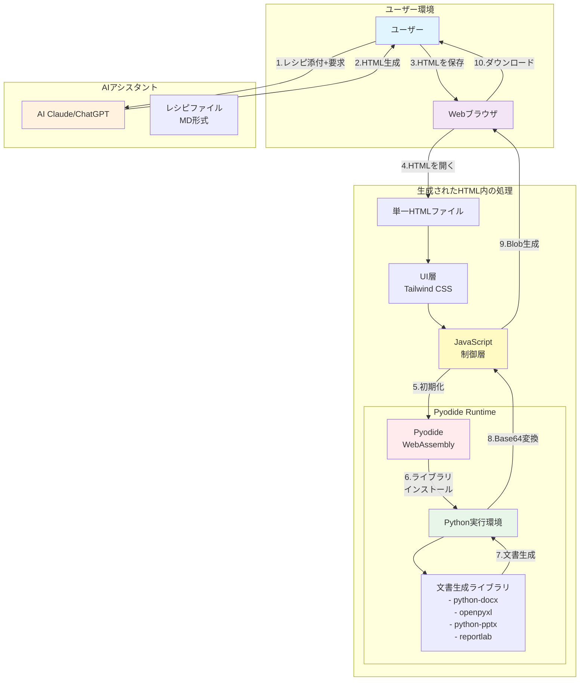

### 1.2 Pyodideの仕組みと制約

#### Pyodideとは

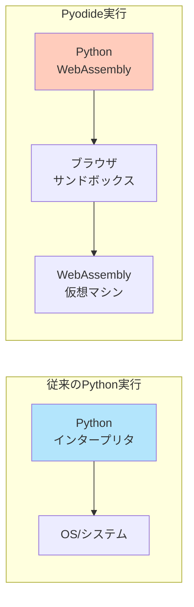

**Pyodideの特徴：**
- CPythonをWebAssemblyにコンパイルしたもの
- ブラウザ内で完全に動作（サーバー不要）
- NumPy、Pandas等の科学計算ライブラリも動作可能
- JavaScriptとの相互運用が可能

**制約事項：**
- ファイルシステムアクセスは仮想的（メモリ上）
- ネットワークアクセスに制限
- 初回ロード時間が長い（~数秒）
- メモリ使用量が多い（基本で~50MB）

### 1.3 ブラウザ内Python実行フロー

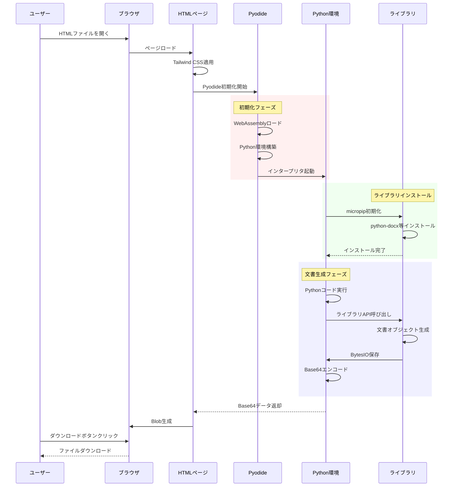

### 1.4 メモリ管理とパフォーマンス

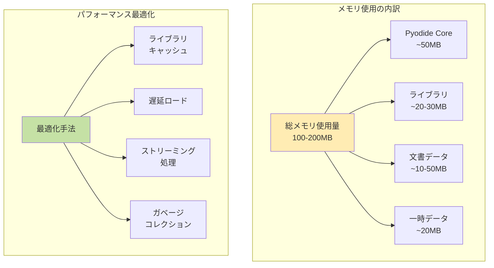

**パフォーマンス特性：**
- 初期ロード: 2-5秒（Pyodide + ライブラリ）
- 文書生成: 0.5-2秒（内容による）
- メモリピーク: 150-200MB
- 最大文書サイズ: ~50MB（ブラウザ制限）

---

## 2. 実装の詳細

### 2.1 各ライブラリの使用方法

#### 文書生成ライブラリの比較

| ライブラリ | 用途 | ファイル形式 | 主要機能 | メモリ使用 |
|-----------|------|-------------|---------|-----------|
| python-docx | Word文書 | .docx | テキスト、表、スタイル | 低 (~10MB) |
| openpyxl | Excel表計算 | .xlsx | セル、数式、グラフ | 中 (~20MB) |
| python-pptx | PowerPoint | .pptx | スライド、レイアウト | 低 (~15MB) |
| reportlab | PDF | .pdf | 描画、フォント、レイアウト | 高 (~30MB) |

#### 実装パターン

```python
# 共通パターン：文書生成の基本構造
from io import BytesIO
import base64
import js

def generate_document():
    # 1. ライブラリ固有のオブジェクト作成
    doc = create_document_object()
    
    # 2. コンテンツ追加
    add_content_to_document(doc)
    
    # 3. BytesIOへの保存
    buffer = BytesIO()
    doc.save(buffer)
    buffer.seek(0)
    
    # 4. Base64エンコード
    bytes_data = buffer.read()
    base64_data = base64.b64encode(bytes_data).decode('utf-8')
    
    # 5. JavaScriptへの受け渡し
    js.document_base64_data = base64_data
    
    return base64_data
```

### 2.2 Base64変換プロセス

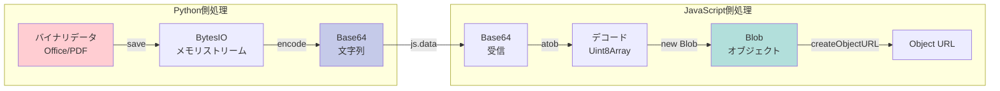

**Base64変換の理由：**
- WebAssemblyとJavaScript間でバイナリデータを安全に転送
- 文字列として扱えるため、相互運用が容易
- ブラウザのセキュリティ制限を回避

### 2.3 エラーハンドリング戦略

```javascript
// エラーハンドリングの階層構造
const errorHandlers = {
    // レベル1: Pyodide初期化エラー
    initializationError: (error) => {
        if (error.message.includes('Failed to load')) {
            return 'Pyodideの読み込みに失敗しました。ネットワーク接続を確認してください。';
        }
    },
    
    // レベル2: ライブラリインストールエラー
    installationError: (error) => {
        if (error.message.includes('ModuleNotFoundError')) {
            return '必要なライブラリのインストールに失敗しました。';
        }
    },
    
    // レベル3: Python実行エラー
    executionError: (error) => {
        if (error.message.includes('IndentationError')) {
            return 'Pythonコードのインデントエラーです。';
        }
        if (error.message.includes('NameError')) {
            return '未定義の変数または関数が使用されています。';
        }
    },
    
    // レベル4: ダウンロードエラー
    downloadError: (error) => {
        if (error.message.includes('Failed to create blob')) {
            return 'ファイルの生成に失敗しました。メモリ不足の可能性があります。';
        }
    }
};
```

### 2.4 画像プレースホルダー機能の実装

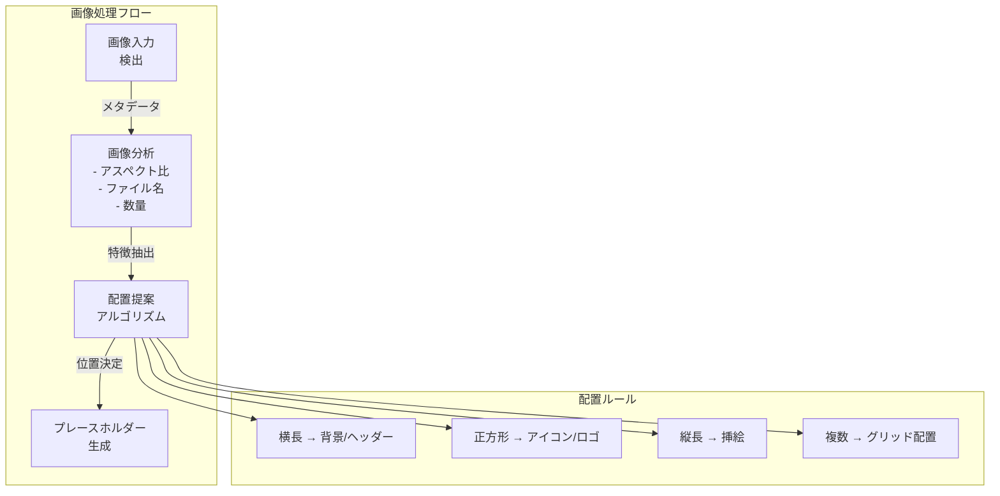

---

## 3. 拡張ガイド

### 3.1 新しいファイル形式の追加方法

#### ステップ1: レシピファイルの作成

```markdown
# 新形式レシピテンプレート構造
1. 必須要件セクション
   - ライブラリインストール指定
   - インデント規則の明記
   
2. HTMLテンプレート
   - Pyodideロード
   - ライブラリインストール
   - Pythonコード実行部
   - ダウンロード処理
   
3. Pythonコード規則
   - 必須インポート
   - 基本構造
   - Base64出力
```

#### ステップ2: 新ライブラリの統合

```python
# 新しいライブラリ追加の例（CSV形式）
await pyodide.runPythonAsync(`
    import micropip
    await micropip.install('pandas')  # 新ライブラリ
    
    import pandas as pd
    from io import StringIO, BytesIO
    import base64
    import js
    
    # データフレーム作成
    df = pd.DataFrame({
        'Column1': [1, 2, 3],
        'Column2': ['A', 'B', 'C']
    })
    
    # CSV変換
    csv_buffer = StringIO()
    df.to_csv(csv_buffer, index=False)
    csv_data = csv_buffer.getvalue().encode('utf-8')
    
    # Base64エンコード
    csv_base64 = base64.b64encode(csv_data).decode('utf-8')
    js.csv_base64_data = csv_base64
`)
```

### 3.2 カスタムテンプレートの作成

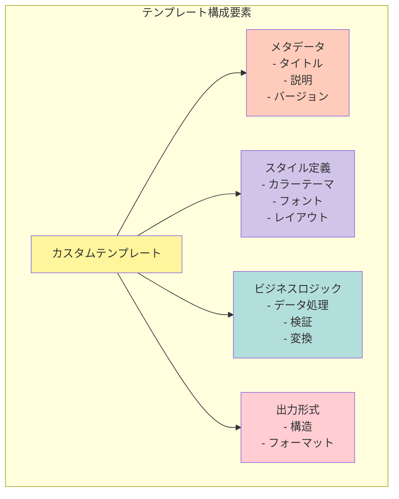

#### カスタムテンプレート実装例

```python
class CustomDocumentTemplate:
    """カスタム文書テンプレートの基底クラス"""
    
    def __init__(self, config):
        self.config = config
        self.styles = self._load_styles()
        self.metadata = self._load_metadata()
    
    def _load_styles(self):
        """スタイル定義をロード"""
        return {
            'primary_color': self.config.get('color', '#000000'),
            'font_family': self.config.get('font', 'Arial'),
            'page_size': self.config.get('size', 'A4')
        }
    
    def _load_metadata(self):
        """メタデータをロード"""
        return {
            'author': self.config.get('author', 'Auto-Generated'),
            'created': datetime.now(),
            'version': self.config.get('version', '1.0')
        }
    
    def generate(self, content):
        """文書生成の抽象メソッド"""
        raise NotImplementedError
    
    def apply_styles(self, element):
        """スタイル適用"""
        # 実装はライブラリ依存
        pass
```

### 3.3 機能拡張のベストプラクティス

#### 1. モジュール化の原則

```javascript
// 機能をモジュールとして分離
const DocumentGenerator = {
    // 初期化モジュール
    init: {
        pyodide: async () => { /* ... */ },
        libraries: async () => { /* ... */ },
        ui: () => { /* ... */ }
    },
    
    // 生成モジュール
    generate: {
        word: async (content) => { /* ... */ },
        excel: async (data) => { /* ... */ },
        powerpoint: async (slides) => { /* ... */ },
        pdf: async (pages) => { /* ... */ }
    },
    
    // ユーティリティモジュール
    utils: {
        encodeBase64: (data) => { /* ... */ },
        createBlob: (base64) => { /* ... */ },
        download: (blob, filename) => { /* ... */ }
    }
};
```

#### 2. プログレッシブエンハンスメント

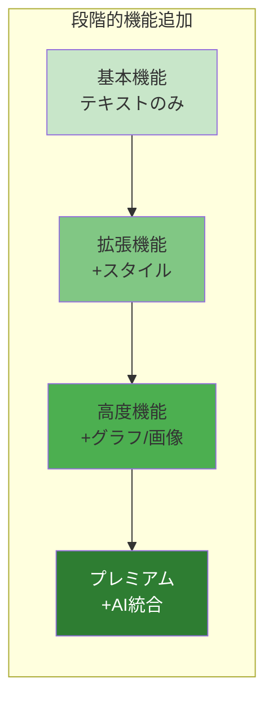

#### 3. エラー耐性の設計

```python
def safe_document_generation(generator_func):
    """デコレータによるエラー耐性の実装"""
    def wrapper(*args, **kwargs):
        try:
            # メイン処理
            result = generator_func(*args, **kwargs)
            return result
        except MemoryError:
            # メモリ不足時のフォールバック
            return generate_lightweight_version(*args, **kwargs)
        except ImportError as e:
            # ライブラリ不足時の代替処理
            return use_alternative_library(e.name, *args, **kwargs)
        except Exception as e:
            # 最終フォールバック
            return create_error_document(str(e))
    return wrapper
```

### 3.4 パフォーマンス最適化テクニック

```javascript
// 1. 遅延ロード戦略
const LazyLoader = {
    libraries: {},
    
    async load(libName) {
        if (!this.libraries[libName]) {
            this.libraries[libName] = await this.importLibrary(libName);
        }
        return this.libraries[libName];
    },
    
    async importLibrary(libName) {
        const startTime = performance.now();
        await pyodide.loadPackage("micropip");
        await pyodide.runPythonAsync(`
            import micropip
            await micropip.install('${libName}')
        `);
        console.log(`${libName} loaded in ${performance.now() - startTime}ms`);
        return true;
    }
};

// 2. メモリ管理
const MemoryManager = {
    threshold: 100 * 1024 * 1024, // 100MB
    
    checkMemory() {
        if (performance.memory) {
            return performance.memory.usedJSHeapSize < this.threshold;
        }
        return true;
    },
    
    cleanup() {
        // Pythonオブジェクトの明示的削除
        pyodide.runPython(`
            import gc
            gc.collect()
        `);
    }
};
```

---

## 4. トラブルシューティング

### 4.1 よくある問題と解決策

#### 問題カテゴリ別対処法

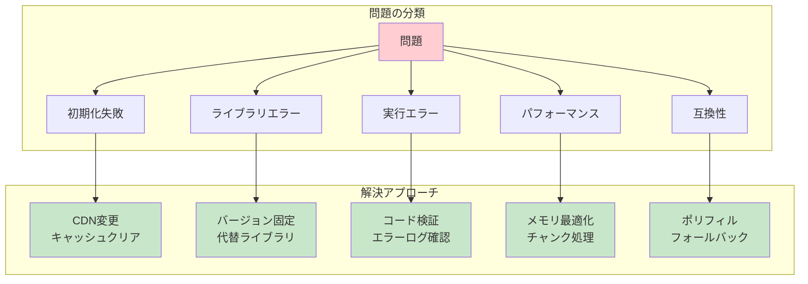

#### 具体的な問題と解決策

| エラーメッセージ | 原因 | 解決策 |
|----------------|------|--------|
| `ModuleNotFoundError: No module named 'xxx'` | ライブラリ未インストール | `await micropip.install('xxx')`を追加 |
| `IndentationError: unexpected indent` | Pythonインデント不正 | コードを左端から開始 |
| `Failed to fetch` | CDNアクセス失敗 | ネットワーク確認、CDN変更 |
| `Maximum call stack size exceeded` | 無限ループ | ループ条件を確認 |
| `Out of memory` | メモリ不足 | データサイズ削減、分割処理 |

### 4.2 デバッグ方法

#### ブラウザコンソールでのデバッグ

```javascript
// デバッグヘルパー関数
const Debug = {
    // Pyodideの状態確認
    checkPyodide() {
        console.log('Pyodide loaded:', typeof pyodide !== 'undefined');
        if (typeof pyodide !== 'undefined') {
            console.log('Python version:', pyodide.runPython('import sys; sys.version'));
            console.log('Loaded packages:', pyodide.loadedPackages);
        }
    },
    
    // メモリ使用状況
    checkMemory() {
        if (performance.memory) {
            const used = performance.memory.usedJSHeapSize / 1048576;
            const total = performance.memory.totalJSHeapSize / 1048576;
            console.log(`Memory: ${used.toFixed(2)}MB / ${total.toFixed(2)}MB`);
        }
    },
    
    // Python実行トレース
    tracePython(code) {
        try {
            console.time('Python execution');
            const result = pyodide.runPython(code);
            console.timeEnd('Python execution');
            return result;
        } catch (error) {
            console.error('Python error:', error);
            console.log('Stack trace:', error.stack);
            throw error;
        }
    },
    
    // Base64データ検証
    validateBase64(data) {
        try {
            const decoded = atob(data);
            console.log('Base64 valid, size:', decoded.length, 'bytes');
            return true;
        } catch (e) {
            console.error('Invalid Base64 data');
            return false;
        }
    }
};
```

#### Pythonコード内でのデバッグ

```python
# デバッグ用ユーティリティ
import sys
import traceback
from datetime import datetime

class DebugLogger:
    def __init__(self, enabled=True):
        self.enabled = enabled
        self.logs = []
    
    def log(self, message, level='INFO'):
        if self.enabled:
            timestamp = datetime.now().isoformat()
            log_entry = f"[{timestamp}] {level}: {message}"
            self.logs.append(log_entry)
            print(log_entry)  # コンソール出力
    
    def trace_error(self):
        """エラートレースを記録"""
        exc_type, exc_value, exc_traceback = sys.exc_info()
        if exc_type:
            trace = traceback.format_exception(exc_type, exc_value, exc_traceback)
            self.log(''.join(trace), 'ERROR')
    
    def memory_usage(self):
        """メモリ使用量を推定（簡易版）"""
        import gc
        gc.collect()
        objects = gc.get_objects()
        self.log(f"Objects in memory: {len(objects)}", 'DEBUG')

# 使用例
debug = DebugLogger()

try:
    debug.log("Document generation started")
    # 文書生成処理
    doc = create_document()
    debug.log(f"Document created with {len(doc.paragraphs)} paragraphs")
except Exception as e:
    debug.trace_error()
    raise
```

### 4.3 パフォーマンス最適化

#### 最適化チェックリスト

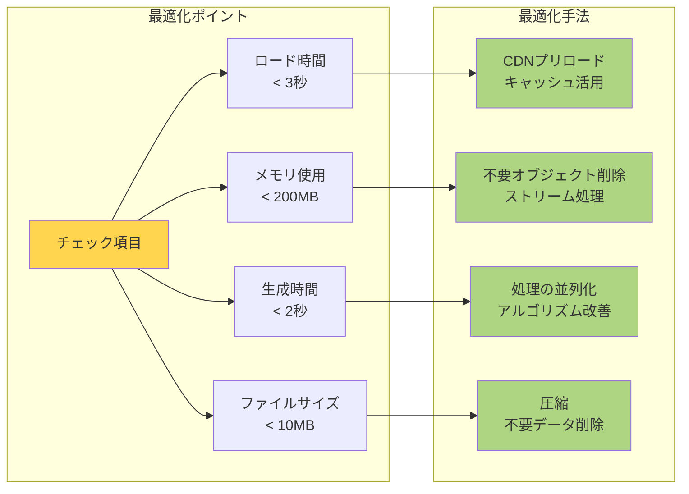

#### パフォーマンス測定コード

```javascript
class PerformanceMonitor {
    constructor() {
        this.metrics = {};
    }
    
    startMeasure(name) {
        this.metrics[name] = {
            start: performance.now(),
            memory: performance.memory ? performance.memory.usedJSHeapSize : 0
        };
    }
    
    endMeasure(name) {
        if (this.metrics[name]) {
            const duration = performance.now() - this.metrics[name].start;
            const memoryDelta = performance.memory ? 
                performance.memory.usedJSHeapSize - this.metrics[name].memory : 0;
            
            console.log(`[Performance] ${name}:`, {
                duration: `${duration.toFixed(2)}ms`,
                memoryDelta: `${(memoryDelta / 1024 / 1024).toFixed(2)}MB`
            });
            
            return { duration, memoryDelta };
        }
    }
    
    async measureAsync(name, func) {
        this.startMeasure(name);
        try {
            const result = await func();
            return result;
        } finally {
            this.endMeasure(name);
        }
    }
}

// 使用例
const monitor = new PerformanceMonitor();

await monitor.measureAsync('total_generation', async () => {
    await monitor.measureAsync('pyodide_init', async () => {
        await loadPyodide();
    });
    
    await monitor.measureAsync('library_install', async () => {
        await installLibraries();
    });
    
    await monitor.measureAsync('document_generation', async () => {
        await generateDocument();
    });
});
```

### 4.4 互換性とフォールバック

#### ブラウザ互換性マトリックス

| 機能 | Chrome | Firefox | Safari | Edge |
|------|--------|---------|--------|------|
| WebAssembly | ✅ 57+ | ✅ 52+ | ✅ 11+ | ✅ 16+ |
| Blob API | ✅ 全バージョン | ✅ 全バージョン | ✅ 全バージョン | ✅ 全バージョン |
| Performance API | ✅ 全バージョン | ✅ 全バージョン | ⚠️ 制限あり | ✅ 全バージョン |
| SharedArrayBuffer | ⚠️ 要HTTPS | ⚠️ 要HTTPS | ❌ 無効化 | ⚠️ 要HTTPS |

#### フォールバック実装

```javascript
// 機能検出とフォールバック
const CompatibilityLayer = {
    // WebAssembly対応確認
    checkWebAssembly() {
        if (typeof WebAssembly === 'undefined') {
            return {
                supported: false,
                fallback: () => {
                    alert('お使いのブラウザはWebAssemblyに対応していません。' +
                          '最新のChrome、Firefox、またはEdgeをご利用ください。');
                }
            };
        }
        return { supported: true };
    },
    
    // Performance API フォールバック
    getPerformanceNow() {
        if (typeof performance !== 'undefined' && performance.now) {
            return performance.now();
        }
        return Date.now(); // フォールバック
    },
    
    // Memory API フォールバック
    getMemoryUsage() {
        if (typeof performance !== 'undefined' && performance.memory) {
            return {
                used: performance.memory.usedJSHeapSize,
                total: performance.memory.totalJSHeapSize
            };
        }
        return { used: 0, total: 0 }; // フォールバック
    },
    
    // Blob URLフォールバック
    createDownloadURL(data, mimeType) {
        try {
            const blob = new Blob([data], { type: mimeType });
            return URL.createObjectURL(blob);
        } catch (e) {
            // 古いブラウザ用のフォールバック
            const dataUrl = `data:${mimeType};base64,${btoa(data)}`;
            return dataUrl;
        }
    }
};
```

### 4.5 セキュリティ考慮事項

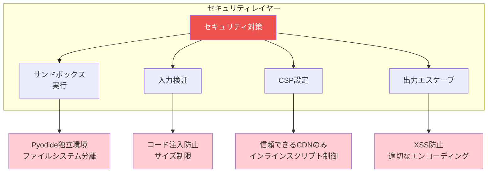

---

## まとめ

このドキュメントでは、Office文書自動生成システムの技術的な詳細を解説しました。

**主要なポイント：**

1. **アーキテクチャ**: Pyodideを活用した完全クライアントサイド処理
2. **実装**: 各ライブラリの効率的な使用とBase64変換による相互運用
3. **拡張性**: モジュール化された設計による容易な機能追加
4. **信頼性**: 包括的なエラーハンドリングとデバッグ支援

このシステムは、サーバー不要でプライバシーを保護しながら、高品質な文書生成を実現する革新的なソリューションです。

---

## 付録

### A. 参考リンク

- [Pyodide公式ドキュメント](https://pyodide.org/)
- [python-docx](https://python-docx.readthedocs.io/)
- [openpyxl](https://openpyxl.readthedocs.io/)
- [python-pptx](https://python-pptx.readthedocs.io/)
- [ReportLab](https://www.reportlab.com/docs/reportlab-userguide.pdf)

### B. 用語集

| 用語 | 説明 |
|------|------|
| WebAssembly | ブラウザで実行可能な低レベルバイトコード |
| Pyodide | WebAssemblyにコンパイルされたPython環境 |
| Base64 | バイナリデータをテキスト形式で表現するエンコーディング |
| BytesIO | メモリ上でバイナリデータを扱うPythonのストリーム |
| Blob | ブラウザで大きなバイナリデータを扱うオブジェクト |
| CDN | Content Delivery Network、分散配信ネットワーク |

### C. バージョン履歴

- v1.0 (2025-01-17): 初版作成
- 技術解説ドキュメントの公開
- Mermaid図による視覚的説明の追加
- 包括的なトラブルシューティングガイド

---

*本ドキュメントは継続的に更新されます。最新版は[プロジェクトリポジトリ]を確認してください。*
